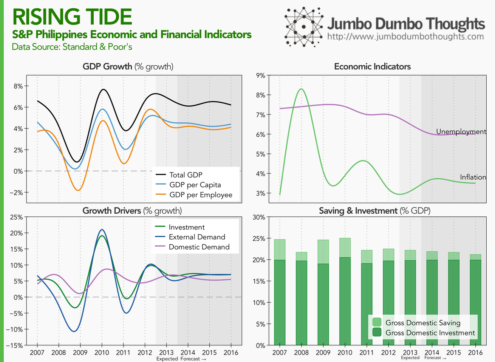
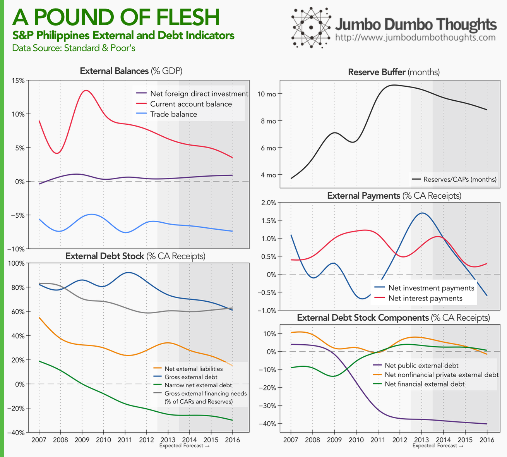
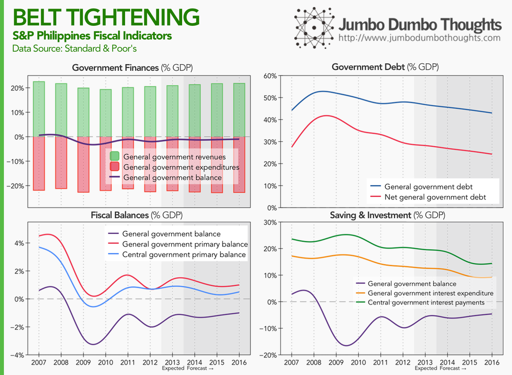

```{r fig.cap="CREDIT UPGRADE - Credit rating's, despite focusing on government-issued debt, include a variety of factors, such as political and economic risks, and are thus used to gauge the overall creditworthiness and economic outlook of a country's economy. In this photos is Makati City, the central business district of the country. (Photo: <a href='https://www.flickr.com/photos/36636097@N05/8947202124/in/photolist-4AaPZ6-4yGofD-79TeY2-cxkU8E-4dRXjX-5ammJb-5wNCny-ehLTLK-5wJgqk-5wNC1W-yERHo-f5ocgo-5wNBTL-5bxfFS-fEVTPm-f714tv-5vmYeA-ehLP7P-eCCKtA-ehM3j6-f9TRrZ-cB9YoG-cxmC3W-fpZzFV-aEhYFY-6fPt8x-ehLUst-6xtxq9-cRxEjf-9n1Dxz-4eMKCh-2hpwHX-6fPsV8-ehSsTS-cxmyHw-cxmKKJ-5zmfho-5ca7GB-ehSyaq-V4AUJ-2htTRw-2htYum-9LnMkg-cqTPnN-ff4sks-eGfkUS-criyhQ-2hu1ib-V312e-bjmBqF/' target='_blank'>chattygd/Flickr</a>, <a href='https://creativecommons.org/licenses/by/2.0/' target='_blank'>CC BY 2.0</a>)", out.width="100%"}

```

The Philippines has received yet another [credit rating upgrade](http://www.rappler.com/business/economy-watch/57581-standard-and-poor-s-ph-credit-rating), from BBB- to BBB, nudging it further into investment-grade territory. What do these letters really mean, though? We can take a look at the data that S&P has provided in support of their decision in this [main](http://www.standardandpoors.com/prot/ratings/articles/en/ap?articleType=HTML&amp;assetID=1245367999069) and [supplementary](http://www.standardandpoors.com/prot/ratings/articles/en/ap?articleType=HTML&amp;assetID=1245355793283) article, to find out more.

Before we look at the data, let's define [sovereign credit ratings](http://www.investopedia.com/terms/s/sovereign-credit-rating.asp). These ratings are regularly provided by ratings agencies (that largest of which are S&amp;P, Fitch, and Moody's) on [sovereign debt](http://www.investopedia.com/terms/s/sovereign-debt.asp) or government issued debt, as a measure of the ability of a certain government to repay debt. Because governments ability to pay is dependent on various risks - political risks can cause policy changes, economic risks can cause changes in tax revenue - these ratings are also used to assess the general economic environment in a country.

The numbers that we will look at are all based on S&P reports. Take note that the figures for 2013 are expected figures, and those for 2014 onwards are forecasts developed by S&P.

## Economic and Financial Indicators: Full Steam Ahead!

The first category of indicators that S&P uses in its assessment are economic and financial indicators that relate primarily to the internal economy and how it is able to generate and continue generating income and tax revenues.

```{r layout="l-body-outset"}

```

GDP growth (upper-left) has been at a very impressive 4%-7% after the impact of the US financial crisis faded in 2009, and is expected to stay within 6% up to 2016. GDP per capita growth, which discounts the effect of population growth, is steady, implying that economic growth will continue to keep pace with the population. The same is true for number of employees. The fact that GDP per capita growth is expected to be higher than GDP per employee growth is because of the expanding labor force or [demographic transition](http://en.wikipedia.org/wiki/Demographic_transition).

Investment and external demand (exports) (lower-left) have been the key drivers of growth for the Philippines, especially in 2010 when investors fled from the troubled US and Europe markets and into emerging markets. Domestic demand has little impact on economic growth.

Good news! Unemployment and inflation (upper-right) have both been on a downward trend - a very rare and exciting economic phenomenon. This suggests an increase in real wages, so that more people can feel the impact of increased economic growth.

Savings rates (lower-right) are not that impressive, hovering at around 25% and expected to fall further up to 2016. This is mitigated by the fact that more of these loanable funds will be used in productive investment, keeping the level of investment constant in relation to output.

S&amp;P cites the public-private partnership program as one of the factors for boosting infrastructure projects, but identifies low GDP per capita levels and slow employment growth as key rating constraints.

## External and Debt Indicators: Paying down the debt

The second category of indicators concerns the economy's interaction with the world at large - foreign investment, foreign debt, and capital flows between the Philippines and the rest of the world.

```{r layout="l-body-outset"}

```

The Philippines' economic performance has caused an improvement in its debt standing. In terms of external balances, [current account](http://www.investopedia.com/terms/c/currentaccount.asp) (upper-left) has stayed at a surplus, meaning that the country is a net lender to the rest of the world. This is because of large OFW remittances, evidenced by the large variance between foreign investment and the current account surplus. The current account surplus is expected to diminish in the future.

In terms of external debt stock (lower-left), all broad and narrow measures of debt are falling. Furthermore, narrow net external debt at a negative level means that we are less vulnerable to shocks if investors decide to pull their funds out of the country since it's now a net external lender. However, gross external financing needs are still high at 60% to 80%, probably because of reliance on OFW remittances, and more recently the BPO sector. S&amp;P doesn't expect these inflows to stop anytime soon, however.

The reserve buffer (upper-right) is high; the country can last 9 to 10 months if funds continuously flow out of the country, without any receipts. In 2015, we can expect to be a foreign investor country ourselves, with [net investment payments](http://www.swissait.com/SAVdb/files/s__p_sovereign_rating_definitions.htm) (middle-right) below zero. [Net interest payments](http://www.swissait.com/SAVdb/files/s__p_sovereign_rating_definitions.htm) are also expected to fall.

If we look at who is contributing to the decrease in the country's debt (lower-right), it's amazingly the government (public external debt) that's getting its foreign debt standing together and thus releasing loanable funds for investment in the private sector. 

## Fiscal Indicators: Prudent Government

The third category of indicators exhibited by S&amp;P relates to fiscal standing, or how well the government is handling its finances (from a strictly inflow-outflow perspective, where those funds come from, and go, is a different question entirely).

```{r layout="l-body-outset"}

```

Government has been able to stay at a slight deficit (upper-left), managing its revenues and expenditures quite well. Furthermore, if we remove the impact of interest payments on preexisting government debt (the resulting measure is known as the [government primary balance](http://en.wikipedia.org/wiki/Primary_balance_(statistical_term))), the figures (lower-left) for both general government (which includes LGUs and GOCCs) and central government are on the positive, meaning that government can support its operations with current receipts and continue paying down debt and subsequently incurring lower interest expense, which is seen in the upper-right panel and the lower-right panel, respectively. However, S&amp;P cites lack of infrastructure and efficient government programs as constraints.

## Other Considerations

S&P also assesses [monetary policy](http://www.investopedia.com/terms/m/monetarypolicy.asp) by the central bank, cites low domestic debt levels, well-anchored and credible monetary policy, and low inflation, as risk-reducing factors, but also notes that high-risk lending to a potentially overheating property sector and underdeveloped capital markets that limit monetary policy transmission as risks.

That's the data behind the BBB rating. Hopefully, you can now see where specifically the Philippines has improved, has faltered, and has jogged in place. Hope you enjoyed reading!

Thanks for reading! If you found this post interesting, I'd really appreciate a share on your social networks or a comment with your thoughts. Data is taken from the [S&P supplementary article](http://www.standardandpoors.com/prot/ratings/articles/en/ap?articleType=HTML&amp;assetID=1245355793283).
