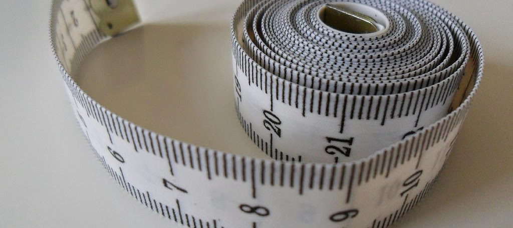
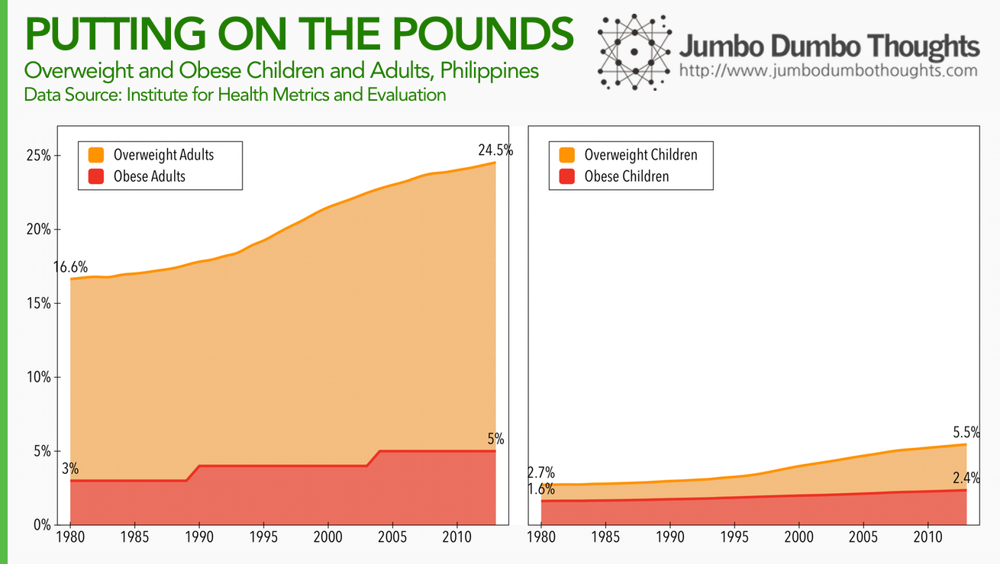
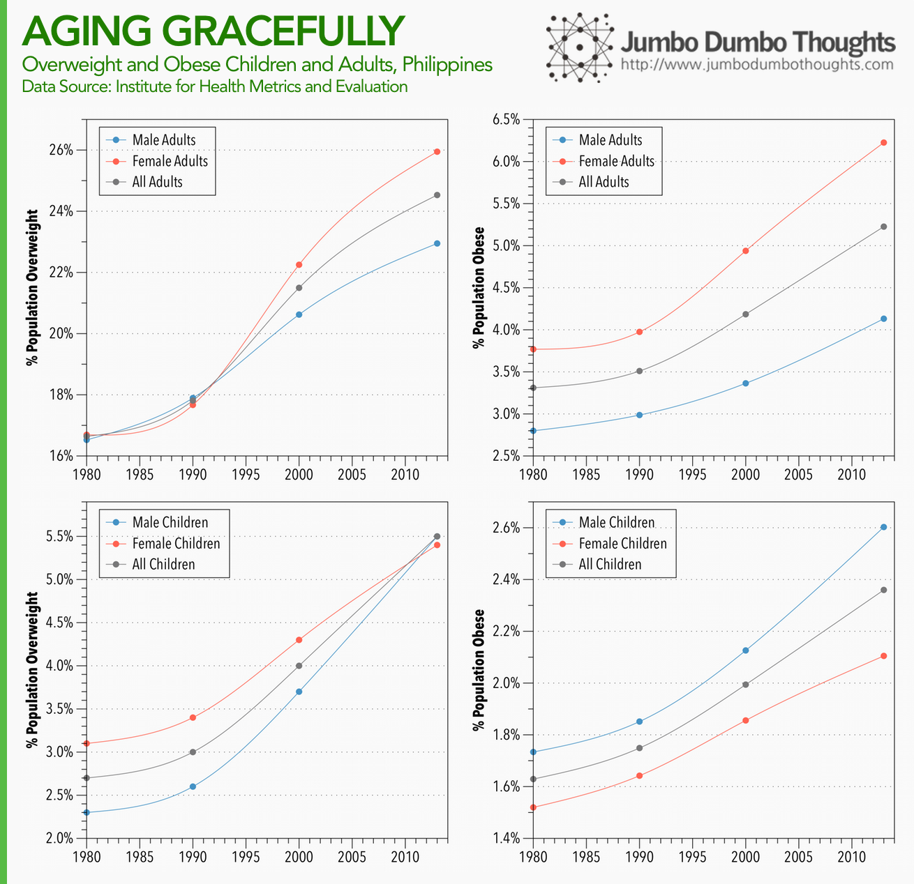
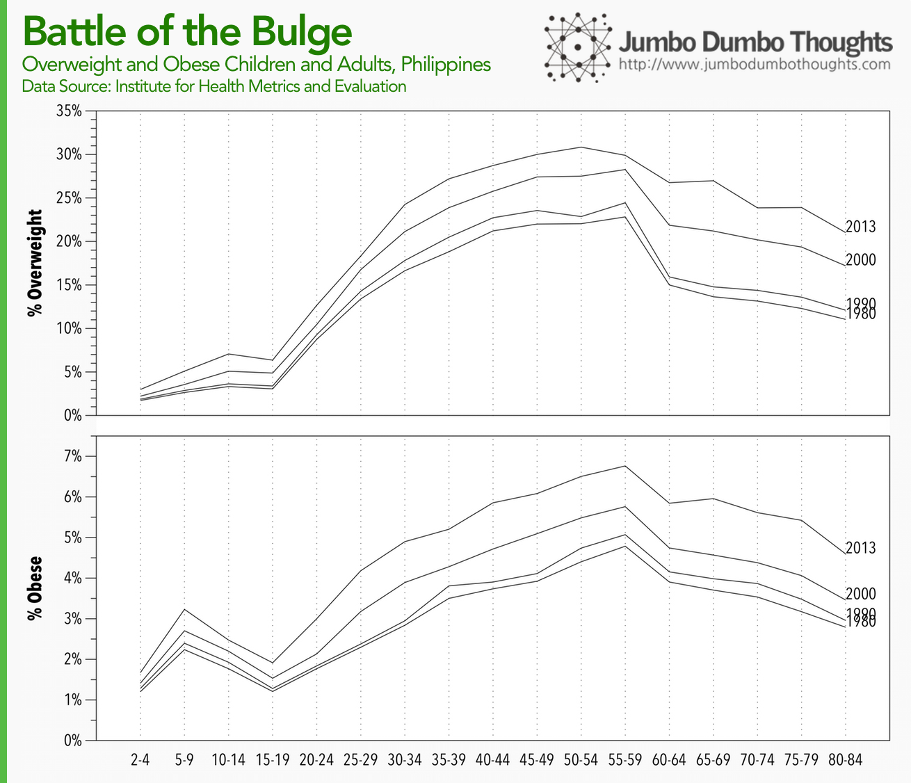

```{r fig.cap="From roughly 16%, 25% of the Filipino population is now overweight. (Photo: <a href='https://www.flickr.com/photos/mecklenburg/5340182341/in/photolist-98TQak-rk7Fq-99k6YX-dMwyx1-99jXti-dj9GSS-khjpe-aXRbri-4iBVma-a52u9R-dd81Ao-5SMUze-hjbY5-4ojfY8-6WiCCm-8roFYt-83eFJY-8roFY4-99ojbj-SKgzj-4qy4Dz-5C8N3x-99ok4G-4ykbdK-9dmSKZ-SLicZ-kXi3-4m1V1d-eiDL7-9cnbxL-5SQ7Yb-5UDjv7-8uTLV7-9tqKos-9gaAi9-8GqcHk-52CjEk-7PXmGk-6tHnck-7BaLZA-89uK8g-672zBa-4eW9Jo-56XFxE-7QkHHh-8GqaQp-8GtmD5-fzFBD2-zfuHb-9rKrhw' rel='nofollow' target='_blank'>Thomas Kohler/Flickr</a>, <a href='https://creativecommons.org/licenses/by-sa/2.0/' target='_blank'>CC BY-SA 2.0</a>)", out.width="100%"}

```

Filipinos love to eat, and the latest report from the [Institute for Health Metrics and Evaluation](http://www.healthdata.org/) (IHME) show that it might be negatively impacting obesity and overweight rates.

First, let's take a look at obesity and overweight rates for both children and adults over time:

```{r layout="l-body-outset"}

```

From 16% (1 in 6) in 1980, Roughly 25% (1 in 4) Filipino adults are overweight. The obesity rate has also increased from 3% to 5% in the past 30 years. For children, the overweight rate has nearly doubled from 2.7% (1 in 40) to 5.5% (1 in 20). Obesity rates have also been on the rise.

Next, let's divide up the population by gender to see the differences between males and females:

```{r layout="l-body-outset"}

```

There is a peculiar trend going on between the sexes. Overweight and obesity rates for female adults are higher than for male adults, but the opposite is true for children. Is this the effect of pregnancy in adulthood?

Lastly, we cut the population into age groups, and see how that's evolved over time:

```{r layout="l-body-outset"}

```

Obesity and overweight rates peak in around your 50's, and are lowest in the late teens. Funnily enough, this seems to correlate with [income over a person's lifetime](/2013/10/why-you-shouldnt-save-while-young.html). The wallet grows and shrinks with the belly, doesn't it?

There you go: a quick data primer on Filipino obesity and overweight rates. I think I'll have to take a rain check on that buffet dinner.

Thanks for reading! If you found this post interesting, I'd appreciate it if you shared it on your social networks, or shared your thoughts in the comments. Data can be gathered from the [IHME website](http://www.healthdata.org/).
