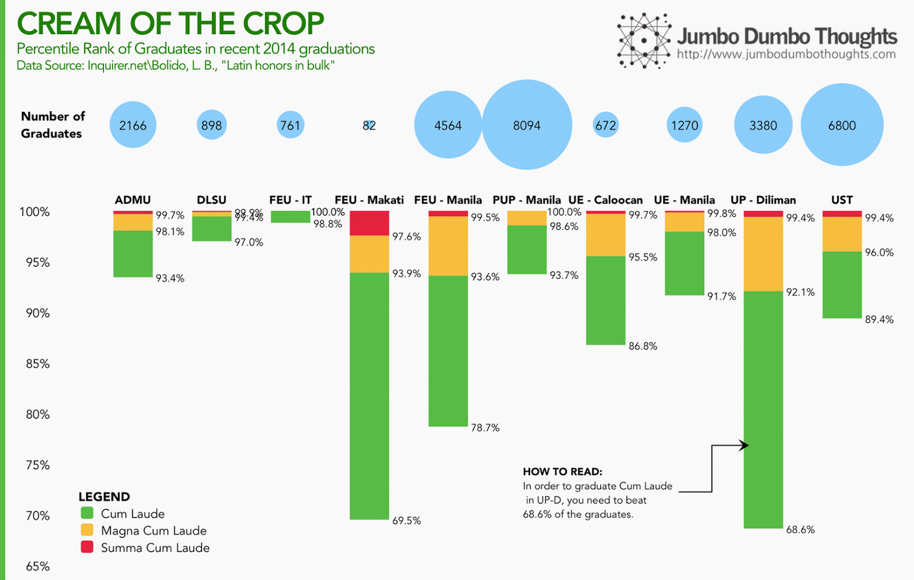

```{r fig.cap="NOT LIKE THE OLD DAYS - Latin honors may not be as exclusive an award as it was before. (Photo: <a href='https://www.flickr.com/photos/gadgetdude/804190044/in/photolist-2e4FFA-fGyTWA-7GM3FE-6Nye7a-4MWo6b-bK5X3V-bwbb3A-9SD2g2-79Eot6-8WEqoW-5gKmFv-79Eosx-79Eorv-8Wvsi2-8WyuBA-8Wyt25-8WvmD2-8Wvk2t-8Wyn5o-8Wyk1A-8Wyios-8WvbRr-2XFyn-79En7r-79En3Z-79Jdmu-79Jdjy-79Jdhy-79Jdgj-79EmTB-79Jdew-79Jd9w-79EmMn-oAYhj-79En6i-79En4R-79En2H-79En1K-79EmVz-4Xyr3e-fXZKj-9e3Y7-fXZhc-6mgFnB-2xbLh-4U7BYy-7teNRt-cgaPAU-7izzPb-7izzzw' rel='nofollow' target='_blank'>gadgetdude/Flickr</a>, <a href='https://creativecommons.org/licenses/by/2.0/' rel='nofollow' target='_blank'>CC BY 2.0</a>)", out.extra="style='max-height:250px; object-fit:cover;'", layout="l-screen"}

```

I was reading this article on how [Latin honors have become increasingly common among graduates in recent history](http://newsinfo.inquirer.net/613771/latin-honors-in-bulk), and it contained interesting comparative data on various universities in Manila.

With that data, I've come up with a chart that displays the various percentile ranks of *cum laude, magna cum laude, and summa cum laude* graduates in recent 2014 graduations of these universities. For example, in UP Diliman, *summa* graduates are among the top 0.6%, *magna* graduates beat out 92.1% of their peers, and *cum laudes* graduated above 68.6% of their batch.

```{r layout='l-body-outset'}

```

FEU-IT, DLSU, and PUP-Manila can be considered among the most stingy with honors, while UP-Diliman, FEU-Makati, and FEU-Manila are the most generous. Now, I wouldn't want anyone to make the almost unavoidable comparisons of "which school is better," so I will state that there are  highly nuanced differences in the quality of education in these schools that cannot be assessed by simply looking at how much of their graduates receive Latin honors. It's just that if you graduated from any of these schools, it's nice to know how you've fared in the batch.

The article goes beyond and tackles the phenomenon in which more graduates, in general, are receiving latin honors. Why is this so? The author lays out some possible explanations: (a) the Flynn effect, where IQ increases per generation, or more ominously (b) grade inflation, where teachers are giving higher grades for equivalent performance for various reasons that were explained clearly in the article.

Whether grade inflation is a serious problem requires more study, but if it is true, then it ought to be curbed. <b>As an award is given to more and more people, it loses its scarcity value and subsequently, its signalling effect. </b>Sooner or later, these Latin honors might not be worth studying hard for anymore.

Thanks for reading! If you found this post interesting, I'd appreciate it if you shared it on your social networks, or shared your thoughts in the comments section. Data can be found in the Inquirer.net article from which this post is based.

## Explore the data

Explore the data on your own using this Tableau interactive chart:

<iframe height="669px" id="tableauiframe" src="https://public.tableau.com/views/JumboDumboThoughts-PompandCircumstance/PompandCircumstance?:embed=y&amp;:showTabs=y&amp;:display_count=yes&amp;:toolbar=no" width="100%"></iframe>
