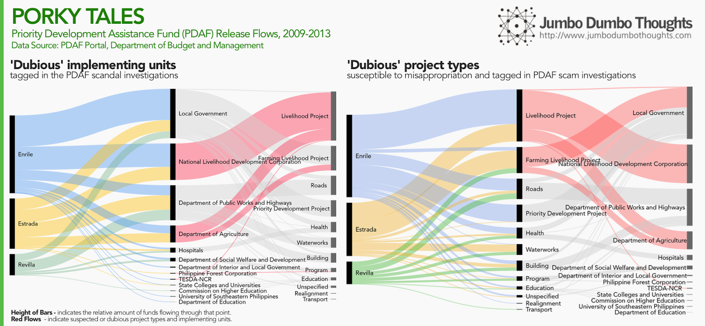
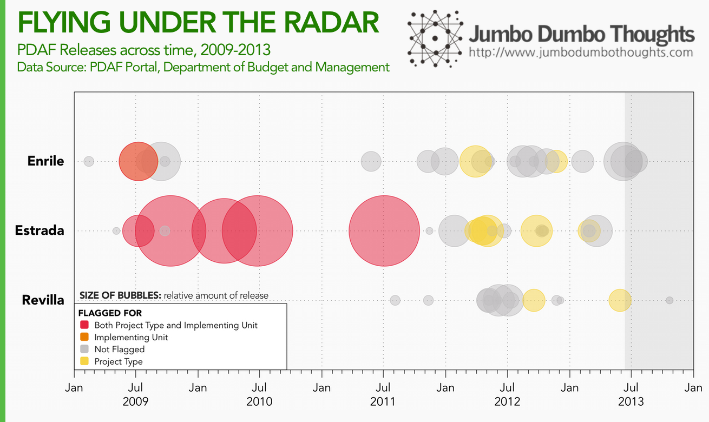

> In one of the rarest moments in Philippine history, three high-ranking lawmakers were arrested on charges of plunder related to the Priority Development Assistance Fund (PDAF), or pork barrel scam. The trial will surely be long and drawn out, but what can we make of the situation as of the moment? Data from the Department of Budget and Management can shed light on the PDAF releases on which these three arrested lawmakers are being charged.

<aside>
```{r fig.cap="For the first time in Philippine history, three Senators have been arrested without bail on charges of plunder. In this photo are the three Senators in question after Sen. Revilla delivered his privilege speech last June 2014.(Photo: Alex Nuevaespaña/Senate PRIB)"}

```
</aside>

On charges of plunder related to the PDAF or pork barrel scam, three senators - Enrile, Estrada, and Revilla - were arrested in separate occasions during the past week, joining the alleged pork barrel mastermind Janet Lim-Napoles in incarceration. The trial will surely play out in a methodical, if not slow, pace, and many Filipinos will be in want of the case's speedy resolution. What we can do right now, is to take [PDAF releases data from the Department of Budget and Management](http://pdaf.dbm.gov.ph/) and use it to take a look at the numbers behind the PDAF scam - how much did they release, to whom, and for what? These are questions we can answer with the data.

I will provide my own analysis, but all the underlying information can be explored via the interactive visualizations that follow each analysis.

## To whom did they release funds, and for what stated purpose?

Initial PDAF scam investigations have alleged that the three senators, along with other lawmakers, colluded with businessperson Janet Lim-Napoles to execute ghost projects through Napoles' fictitious Non-Governmental Organizations (NGOs). Many of these were 'soft' projects and related to livelihood programs and farming, provided to agencies National Livelihood Development Corporation, Philippine Forest Corporation, TESDA, and the Department of Agriculture.

So, just how much of these funds went to soft farming and livelihood projects, and how much of the funds were coursed through the accused agencies?

```{r layout="l-screen-inset"}

```

The lion's share of the three lawmakers' appropriations went to livelihood projects and farming livelihood projects, coursed through the investigation-tagged agencies. All other appropriations like health, waterworks, roads, and others pale in bundle exec jekyll buildcomparison.

**Explore the data on PDAF releases by project type and implementing unit:**

<iframe height="669px" id="tableauiframe" src="https://public.tableau.com/views/JumboDumboThoughts-PDAFScam/Basic?:embed=y&amp;:showTabs=y&amp;:display_count=yes&amp;:toolbar=no" width="100%"></iframe><br>

## When did these releases take place?

A lot can be learned during investigations by observing changes in behavior as the crime is being discovered and perpetrators react to new information, so it would be useful to take a look at the time trend of these pork barrel releases as well. When did they release these funds, for what purpose, and through which agencies?   

```{r layout="l-body-outset"}

```

I've categorized the releases according to their 'red flags' - if they were released for livelihood or farming, if they were coursed through alleged 'dubious' agencies,  or both. As you can see, there were large high-risk releases in the earlier period from 2009-2011, but the releases suddenly shrank in size towards 2012 and 2013. Also, in the past two years, the funds were not anymore being released through dubious agencies but usually through local government units, despite being for the same purpose.

**Explore the different transactions across time:**

<iframe height="569px" id="tableauiframe" src="https://public.tableau.com/views/JumboDumboThoughts-PDAFScam/TimeDistribution?:embed=y&amp;:showTabs=y&amp;:display_count=yes&amp;:toolbar=no" width="100%"></iframe><br>

## What provinces presumably benefited from these PDAF Releases?

The original purpose of the pork barrel was to enable lawmakers to support projects in the countryside - is this still the case? Also, since the lawmakers in question are Senators, elected by the national electorate, do they still play favorites for their home provinces?  *(Note: the top-right bubble indicates releases for projects that have a nationwide scope.)*

<iframe height="669px" id="tableauiframe" src="https://public.tableau.com/views/JumboDumboThoughts-PDAFScam/GeographicDistribution?:embed=y&amp;:showTabs=y&amp;:display_count=yes&amp;:toolbar=no" width="100%"></iframe><br>

As you can see, all three lawmakers are pretty much primarily focused on the capital. Enrile has a slight bias towards Pangasinan, Cagayan, and Negros Occidental. Revilla leans toward Cavite, Northern Samar, and Nueva Ecija. Estrada prefers, Pangasinan, Quezon, and Basilan. **You can explore the data for yourself using the map above.**

## Some conclusions

Overall, there seem to be many red flags in relation this data:  

  * High commonality towards soft livelihood and farming projects.
  * Nearly simultaneous shrinkage in release size upon the start of the Aquino administration.
  * Sudden shift from dubious agencies, but no change in purpose (livelihood/farming).

However, only time will tell whether the allegations against them are true. There is a reason why courts take so long to decide cases - a careful consideration of the evidence is necessary for the imposition of a just verdict. I guess we'll just have to see what happens. For now, we have this data to guide our judgement.

Thanks for reading! If you found this post interesting or otherwise enjoyable, I would really appreciate if you could like, share, tweet, or +1 this on your social networks. I would also like you to share your thoughts in the comments section. Data and computation requests are entertained through the contact page/form.
