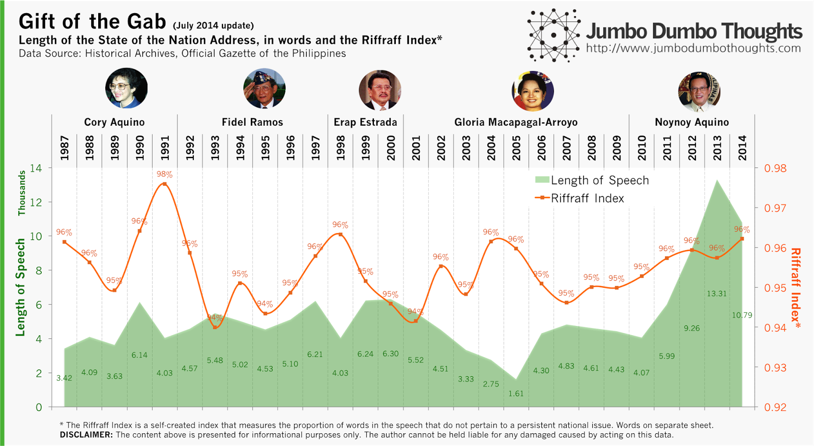
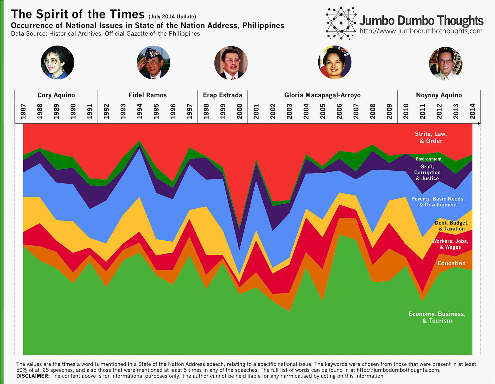
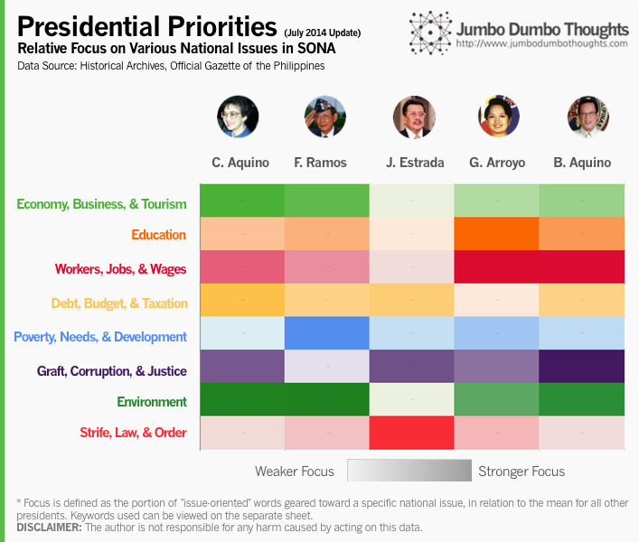

```{r fig.cap="Aquino's 5th SONA word counts suggest a shift of focus from current national issues toward long-term legacies such as education, budget management, and poverty alleviation. However, the overall message echoed by the administration remains the same. (Photo: Official Gazette, public domain)", out.width="100%"}

```

I previously wrote a post that tries to get a feel of the priorities of each administration at various points in time, by measuring how many times each speech mentions certain words that relate to national issues. Following the recent 2014 SONA of President Aquino, we update the data to see what's changed, and whether there are any shifts in the priorities of his administration.

Please feel free to read the [original post](/2014/02/sona-words.html) to view how this data was collected, shaped, and presented.

## The Basics: Length of speech and the Riffraff index

Let's take a look at the overall length, and how much of the speech actually contained meaningful content, as measured by the Riffraff Index.

```{r layout="l-body-outset"}

```

President Aquino's 5th SONA is shorter than last year's, but still quite long at around ten thousand words, making it the second longest SONA since his mother's time. Despite this cutting down of length, the amount of riffraff increased, probably due to his lengthy discussion of various calamities and also the legacy statement near the end of the speech.

## Presidential Priorities 2014: Education, government finance, and poverty

Let's use [the same criteria](https://dl.dropboxusercontent.com/u/1624796/Blog/Images/Keywords.pdf) to determine the trends in the priorities of various administrations. Will it have changed for President Aquino? Let's find out:

```{r layout="l-body-outset"}

```

The President focused more on education (TESDA), poverty (poverty rate and conditional cash transfers), and government finance (debt management, investment rating upgrade) compared to previous speeches. There was less focus on environment and law and order compared to previous speeches. As the term ends, the administration might be focusing more on long-term legacies such as education and balancing government books rather than current issues such as corruption, law and order, economy, and employment.

## Priority Heatmap: No change in overall priorities

How does the new data affect the overall priorities of the Aquino administration? The answer is: not much.

```{r layout="l-body", out.width="100%"}

```

Overall, compared to other administrations, the Aquino administration is still very much focused on both graft, corruption, justice and workers, jobs, wages, with a slight shift towards education.

## Interactive Word Counter

You don't have to take my word for it; the word count data is available for you to explore and draw insights from. Just input the words you'd like to count in the five white boxes (use space to clear out a cell), and see it reflected in the graph.

<iframe frameborder="0" height="368" width="100%" scrolling="no" src="https://onedrive.live.com/embed?cid=0DD6BA9773242112&amp;resid=DD6BA9773242112%21136&amp;authkey=AA4d9nTxwe9Ehqw&amp;em=2&amp;wdAllowInteractivity=False&amp;AllowTyping=True&amp;ActiveCell='Interactive'!B5&amp;Item='Interactive'!A1%3AC19&amp;wdHideGridlines=True" width="645"></iframe>

Hope you enjoy discovering new trends with the tool! If you find an interesting pattern, please don't hesitate to share it in the comments! 

Thanks for reading! If you enjoyed reading, I'd appreciate it if you shared this with your friends or comment below. Data and computation inquiries can be made through the contact form or the comments.
