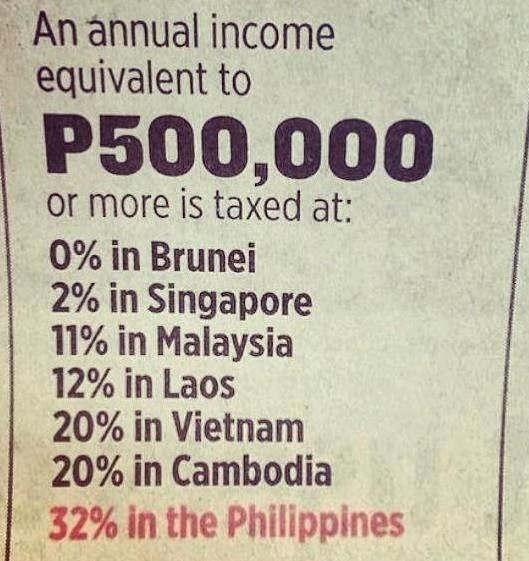
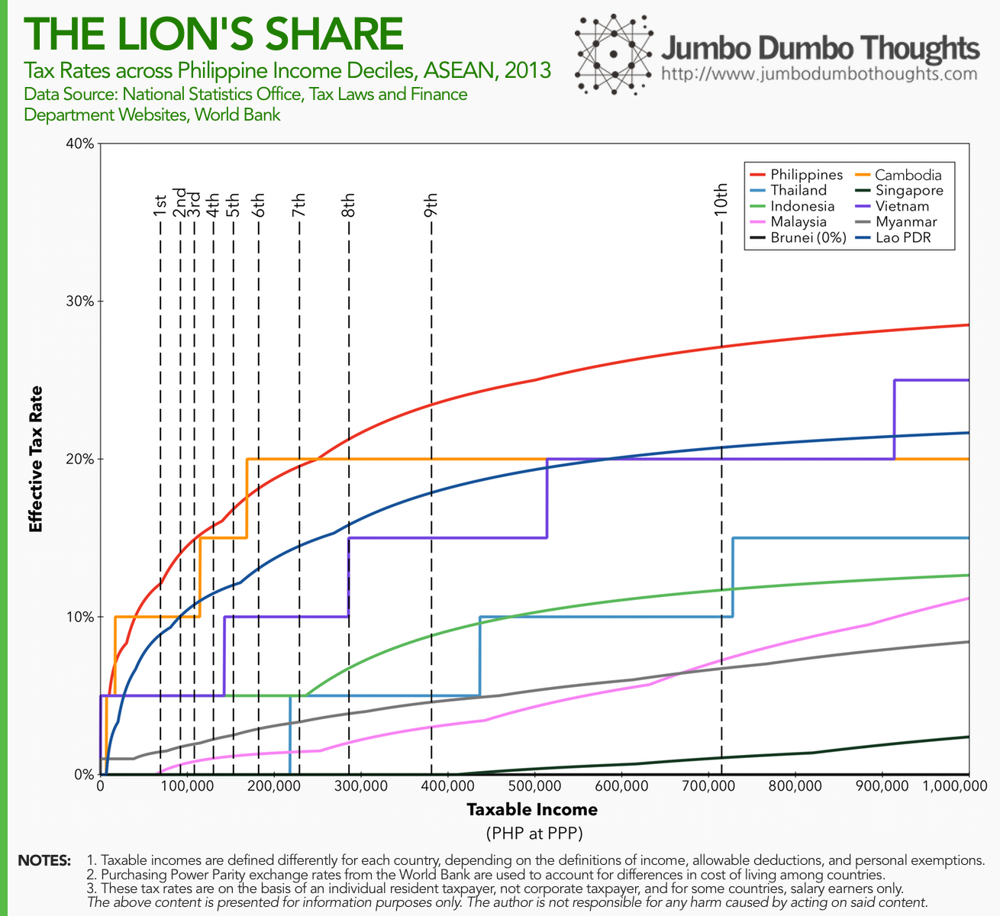
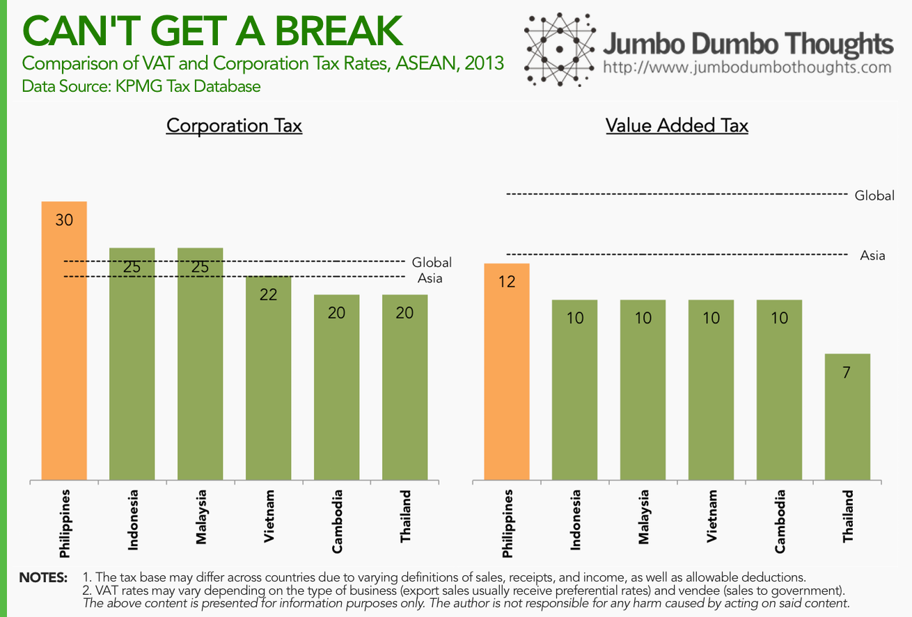
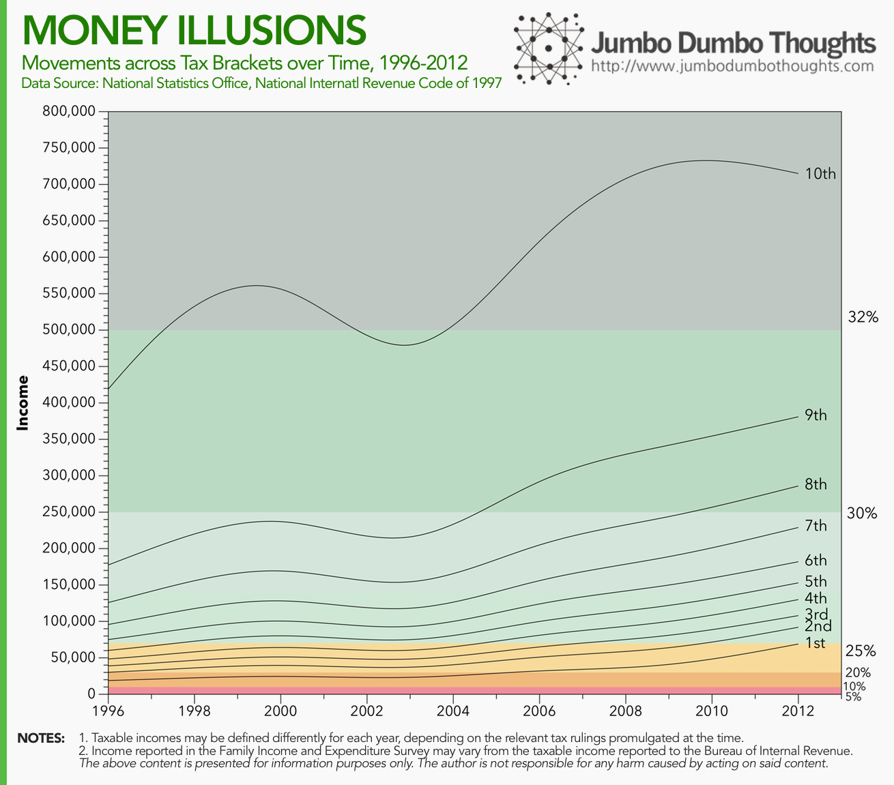
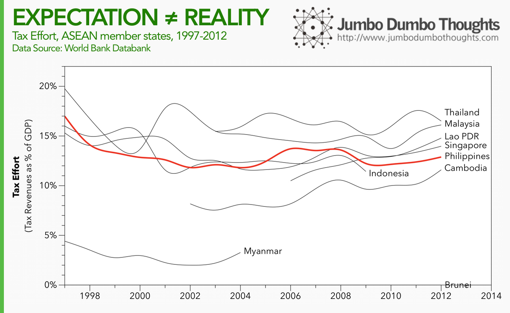

```{r fig.cap="LABORIOUS LEVIES - This ad in a newspaper cites the claim of the Tax Management Association of the Philippines, taken from the Instagram account of Senator Sonny Angara, one of the main advocates for reducing income tax rates.", out.width="500px"}

```

The Tax Management Association of the Philippines (TMAP) claims that Filipinos [pay the highest tax rates among countries in the Association of Southeast Asian Nations (ASEAN)](https://anc.yahoo.com/news/pinoys-pay-highest-tax-rate-among-asean-countries-024741139.html). This is their basis for arguing in favor of [lower income taxes and inflation-sensitive tax brackets.](http://www.interaksyon.com/business/93268/tax-consultants-organization-bats-for-lower-income-tax-rates-inflation-sensitive-brackets). While the debate on whether lower taxes can be an overall sound policy rages on, let's focus on this particular claim and determine whether Filipinos really do pay the highest taxes in the region.

Gathering the data on tax brackets from tax laws and revenue issuances, as well as converting taxable income into the appropriate currency may appear straightforward, but there are three ways in which this assertion may be inaccurate:

  * P500,000 was used as the tax base, but it could be possible that Philippine rates are lower at different levels of income. Also, quoted rates are [marginal tax rates](http://www.investopedia.com/terms/m/marginaltaxrate.asp), which are imposed on additional income, not the entire amount. Using [effective tax rates](http://www.investopedia.com/terms/e/effectivetaxrate.asp) provides a more holistic picture. 
  * Market exchange rates may have been used to convert the P500,000 income amount, which could be inconsistent due to differences in the cost of living among countries. Using [purchasing power parity (PPP) exchange rates](/2014/05/numbersense-purchasing-power-parity.html) adjusts for these differences.
  * High income tax rates may be offset by lower rates on other forms of taxes such as the value-added tax/goods and services tax/sales tax, or corporate tax.
  
Let's investigate whether or not the results change when adjusting for these concerns.

## What about other levels of taxable income?

TMAP's claim focuses on tax rates on a taxable income of P500,000; let's expand it and compute the effective tax rates for a broad spectrum of taxable incomes, from nil to P6 million. Moreover, let's use PPP exchange rates to adjust for cost of living.

```{r, out.width="100%"}
knitr::include_graphics("images/20140824-taxman-cometh.png")
```

It turns out that the TMAP was pretty much correct, with a few minor exceptions. Cambodia's tax rates exceed the Philippines for a brief moment at around the P250,000 taxable income mark. Also, Thailand and Vietnam tax the highest incomes much more aggressively at 35% compared to the Philippines' 32%. You can see that at P500,000, TMAP's selected basis, the Philippines does impose the highest tax rates.

How is this relevant for Filipinos? Let's superimpose the average incomes for Filipinos at different income deciles to find out:

```{r, out.width="100%"}

```

From the poorest 10% up to the richest 10% of Filipinos, tax rates are highest in the Philippines than any other ASEAN member country, with the exception of Cambodia for the 6th and 7th income decile (upper-middle class).

## What about if other taxes, like Corporation Tax or VAT, are lower?

What if these high income tax rates are compensated by lower rates on other forms of tax? Let's take a look at VAT/GST/Sales taxes and corporate taxes among ASEAN member countries:

```{r, out.width="100%"}

```

There is really no consolation for Filipinos here. Corporate taxes are very high at 30%, exceeding all ASEAN member countries as well as the global and Asia averages. VAT/Indirect Tax rates are lower than the global or Asia averages, but still higher than any other ASEAN member state.

## How could this have happened?

How could the Philippines impose such high tax rates compared to its ASEAN peers? I can think of two possible explanations: (a) fixed tax brackets that do not adjust for inflation (as the TMAP asserts), and (b) poor tax administration.

The National Internal Revenue Code's Section 19A (the individual income tax table) hasn't been updated since the law was created in 1997. Because of inflation, a peso back then was worth much more than a peso in the present. This has resulted in the poorest Filipinos moving to a higher tax bracket despite no real change in wealth.

```{r layout="l-body-outset"}

```

The poorest 10% of Filipinos moved from a 10% tax rate in 1997 to almost 25% in 2012. The same story plays out for other income deciles. The richest 10% of Filipinos can now expect to be taxed at the highest marginal tax rate of 32%.

The second explanation may be poor tax administration. Because of [a large informal sector](/2013/10/tax-evasion-philippines.html), corruption, and tax evasion, law-abiding taxpayers have to be taxed at a higher rate to generate the same amount of tax revenue for the government. Poor tax administration does not only include the performance of revenue authorities but also taxpayer attitudes such as non-registration, underdeclaration of income, and other tax avoidance activity.

```{r layout="l-body-outset"}

```

Among its ASEAN peers, the Philippines has a middling tax effort despite high tax rates, suggesting that poor tax administration plagued the past decade.

## Notes and Caveats

I would like to make one thing clear - this is an investigation into the assertion that Filipinos pay the highest tax rates, and an exploration of how this could have happened. This article does not attempt to explain whether lower income tax rates would be beneficial to the economy and society as a whole. Such a question involves a more nuanced and complicated answer. Also, please be reminded to read the caveats and notes accompanying each set of data.

**So, do Filipinos really pay the highest taxes among ASEAN member countries? Well, yes.**

If you found this post interesting, I would appreciate it if you liked, shared, tweeted, or +1'ed it on your preferred social network. I would also love to hear your thoughts in the comments section below.

Can you do more with this data? [Download the underlying data](https://onedrive.live.com/redir?resid=dd6ba9773242112!11241&amp;authkey=!AFhgNFPDM4k_kyc&amp;ithint=file%2cxlsx).
