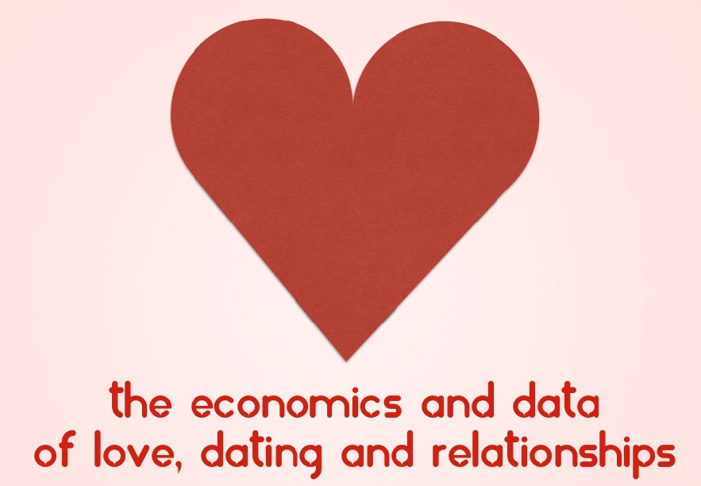

```{r out.width="100%"}

```

Last Valentine's Day, I was asked by my former college organization to deliver a talk on the "data of love, dating, and relationships" as part of their Young Economists' Lecture and Learning Series at De La Salle University.

I thought I'd share the presentation with you and put this up for posterity's sake. Hopefully, you can piece together what I was talking about.

<iframe allowfullscreen="" frameborder="0" height="530" marginheight="0" marginwidth="0" scrolling="no" src="//www.slideshare.net/slideshow/embed_code/38292198?rel=0" style="border-width: 1px; border: 1px solid #CCC; margin-bottom: 5px; max-width: 100%;" width="650"> </iframe><br />

I'd appreciate it if you liked, tweeted, shared, or&nbsp;+1'ed this post on your preferred social network, as well as shared your thoughts in the comments section.
