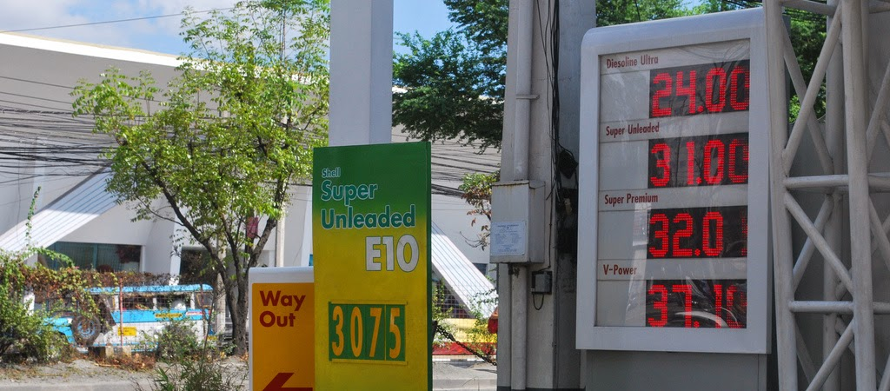

```{r fig.cap="BLACK GOLD - In a time of risi'ng oil prices, it might pay off to be a little more data-savvy about where you gas up. (Photo: <a href='https://www.flickr.com/photos/trishhhh/4311644023/in/photolist-7z1iy4-7z561U-7z56hE-7z56GE-7z567G-7z5cJE-7z5cy9-7z1rZB-7z54i3-7z57Ey-7z5fmo-7z57eA-7z1orD-7z1qr2-7z1sM8-7z55EN-7z585b-7z1tfF-7z5cDh-7z5aCQ-7z5ct9-7z1sag-7z1qmx-7z58JW-7z58aw-7z1kp4-7z1oiz-7z1reD-7z1nL6-7z1nER-7z1nuK-7z5cWy-7z1ieV-7z1hag-7z59aY-7z1sEg-7z57zJ-7z56My-7z1sRK-7z58E9-7z59pY-7z1j3c-7z1hBR-7z57ns-7z591b-7z5c4A-7z5adG-7z5bSb-7z58fJ-7z1oYt' target='_blank'>Patricia Feaster/Flickr</a>, <a href='https://creativecommons.org/licenses/by/2.0/' rel='nofollow' target='_blank'>CC BY 2.0</a>)", out.width="100%"}

```

Everyone has something to say about gas prices - it's cheaper to gas up with this provider than another, or it's more economical to fill the tank in this area than another. With data from the Department of Energy's price watch, we can provide data-driven answers to these questions, so that you can stretch out your gas money for just a few more kilometers.

Please note that these prices are the latest as of the original post date - August 31, 2014.

## Which providers offer the least expensive fuel?

Let's first take a look at retail pump prices across petroleum providers. This chart is interactive - you can refine your analysis by fuel type (regular/premium gasoline/diesel), and also by location (urban centers in the country).

<iframe height="649px" id="tableauiframe" src="https://public.tableau.com/views/JumboDumboThoughts-RetailPumpPrices/Provider?:embed=y&amp;:showTabs=y&amp;:display_count=yes&amp;:toolbar=no" width="100%"></iframe>

**Here are some quick observations from an initial perusal of the data:**
      
  * For the three major providers (Caltex, Shell, Petron):
    * Caltex seems to be the most expensive for regular gasoline, but it is the least expensive for diesel.
    * Shell's diesel is the most expensive, but it is far cheaper for premium gasoline (higher octane number).
    * Petron is the cheapest for regular gasoline, but its offering of premium gasoline is the most expensive.
  * For Metro Manila:
    * City Oil is the least expensive option for gasoline, while Flying V is the least expensive option for diesel. 
    * Unioil has the largest range in its prices, suggesting that it is the most aggressive in discriminating prices in between different parts of Metro Manila.
    * Smaller providers are strewn around the lower end of prices for gasoline, but some are also quite expensive for diesel.
  * On average, for all parts of the country and various fuel types, Shell is the most expensive among major providers, followed by Caltex, then Petron.
  
There are many more trends, patterns, and observations that you could draw from this data, so please feel free to explore and refine your analysis, and to share your insights in the comments section below.  

## Where is it cheaper to gas up?

Let's now compare across cities to see in which areas fuel is least expensive. This chart is also interactive - you can refine the analysis by fuel type, and by petroleum provider.

<script src="https://public.tableausoftware.com/javascripts/api/viz_v1.js" type="text/javascript"></script>  
<iframe id="tableauiframe" src="https://public.tableau.com/views/JumboDumboThoughts-RetailPumpPrices/Geography?:embed=y&:showTabs=y&:display_count=yes&:toolbar=no" height="719px" width="100%"></iframe>

**A few observations about this set of data:**
     
  * Fuel prices are much lower in large urban centers - Manila, Cebu, and to a certain extent, Davao. It gets more expensive as you move away from these highly developed areas, probably reflecting logistics and coordination costs.
  * Diesel prices are much more equal across geographical areas than gasoline prices.
  * Lipa and Batangas City, despite being close to the country's capital, exhibit high gasoline prices.
  * Caltex, Shell, and Petron's pricing structures across geographical areas are quite similar.
  * Again, please feel free to explore, refine, and share your findings in the comments!

So, where can you gas up for less? Among major providers, Petron is the way to go for regular gasoline, Shell is cheapest for premium gasoline, and Caltex is best for diesel.

Thanks for reading! If you found this post interesting or useful, I'd appreciate it if you liked, shared, tweeted, or +1'ed it on your preferred social network, or shared your thoughts and findings from the interactive chart in the comments section below. Data and computation requests can be made through the contact form.
