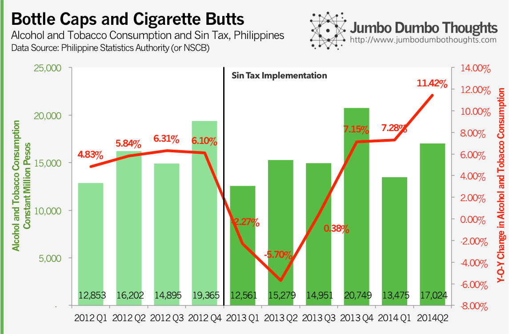
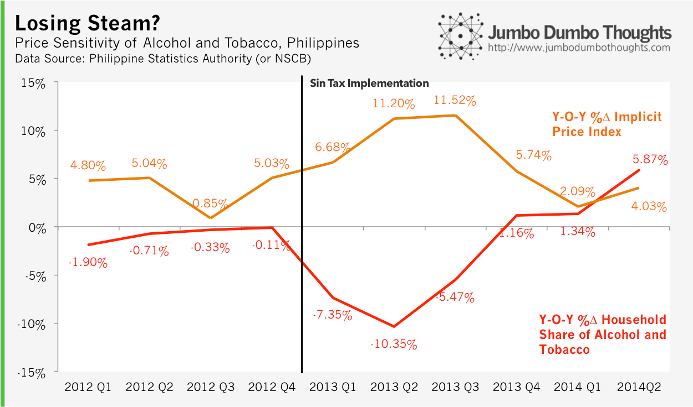

```{r fig.cap="How are higher sin taxes faring a year and a half after their implementation? (Photo: <a href='http://www.flickr.com/photos/42787780@N04/6447396935/in/photolist-aPJAu8-aPJA2K-aPJiY6-aPJjrx-eXvDMN-fmXy7c-btTEZa-9yka4g-9ykbXK-9ykbtx-9ykaT4-9yo9XG-9yob4h-9ykakx-9ykaAZ-9yobFu-9ykbaV-9yobRy-9ykbk8-9yoayw-eXvCPq-bMk2TX-eXjgdp-dEMcLv-g5LvKo-9ykadv-cdvXhy-epGBdG-epGBUU-ebNTL5-ebHf9v-ebNTAC-ebNTR1-ebNTH5-cnPApL-9Y8WeF-dpWNyc-dpWNCi-dpWNoF-dFyVMS-dgDLUo-dYA2Yy-d9k397-d9k3gu-d9k3kh-d9k3d1-99ZyZV-83eMed-ahbVQG-aa63H9-ahbVPf/'>Fried Dough/Flickr</a>, <a href='http://creativecommons.org/licenses/by/2.0/'>CC BY 2.0, cropped</a>)", out.width="100%"}
knitr::include_graphics("images/20140916-cigarette.png")
```

When we first covered the [new sin taxes in 2013](/2013/09/effectiveness-sin-taxes.html), we focused on its effect on household consumption of alcohol and cigarettes, and subsequently [updated it](/2013/12/effectiveness-sin-taxes-philippines-2013q3-update.html) to reflect the 2013Q3 stats. Now that sin taxes have been in effect for roughly a year and a half and has even [kicked it up a notch](http://www.gmanetwork.com/news/story/341781/economy/finance/cigarette-prices-up-p5-a-pack-in-2014-as-sin-tax-bites-anew), let's review national accounts data from the Philippine Statistics Authority (then NSCB), to see how it has fared.

## Old habits die hard

For 2013, especially for the first three quarters of sin tax implementation, consumption of alcohol and tobacco products seems to have fallen dramatically, year-on-year (note that we make comparisons on a year-on-year basis in order to ward off the effects of seasonality).

```{r out.width="100%"}

```

However, as Christmas season dawned, people seem to have forgotten about the new taxes and consumption increased significantly. This trend has continued throughout the rest of the following year, with the second quarter of 2014 posting double-digit increases in sin product consumption.

## Ningas cogon

The latest national accounts data indicate that the effect of sin taxes on consumption may be losing steam. 

```{r out.width="100%"}

```

In a rather disappointing turn of events, the prices for alcohol and tobacco products stopped rising, and in turn, the household share of alcohol and tobacco has stopped falling. It may be due to [anchoring](http://en.wikipedia.org/wiki/Anchoring) or [downshifting to lower-priced cigarettes](http://www.sunstar.com.ph/breaking-news/2014/05/22/group-phl-still-has-low-cigarette-prices-344166), but then again this might just be a case of [ningas cogon](http://www.philippinestudies.net/ojs/index.php/ps/article/viewFile/765/765).

It is likely that sin product consumption will continue to increase, with [sin product removals in the first half of 2014 increasing by 3%](http://www.philstar.com/business/2014/08/26/1361688/cigarette-consumption-rises-3-h1).

Despite these results, the silver lining is that that the [BIR's sin tax collection target for the first half of 2014 was exceeded](http://www.abs-cbnnews.com/business/08/21/14/sin-tax-collection-exceeds-bir-target-h1). This money can then be used for public health programs.

Thanks for reading! If you found this post interesting, I would appreciate it if you liked, shared, tweeted, or +1'ed it on your preferred social network, or shared your thoughts in the comments section below. For data requests, please see the policies page.
