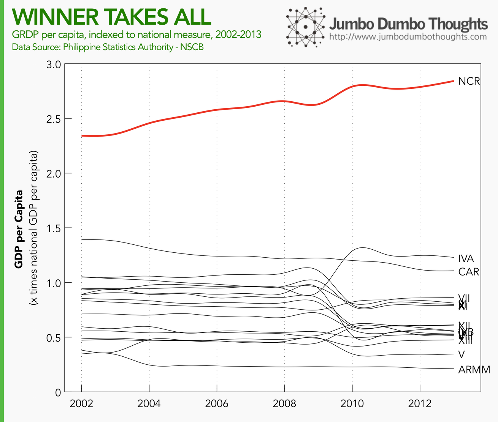
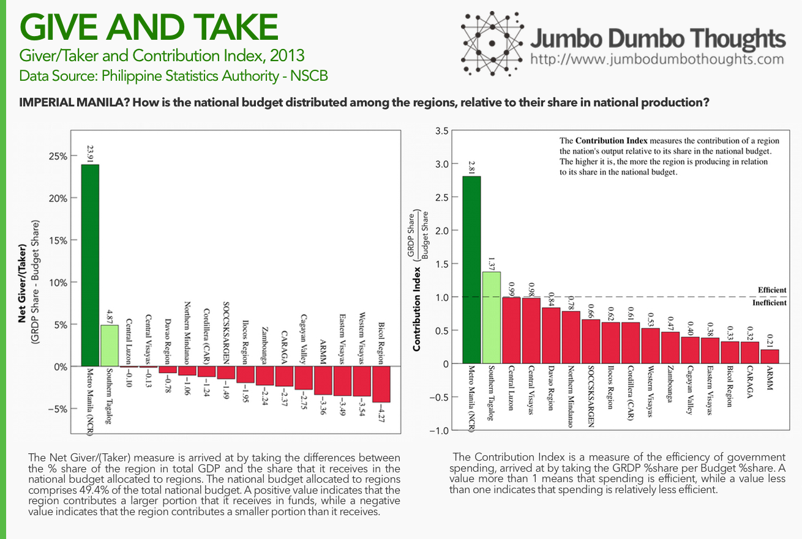
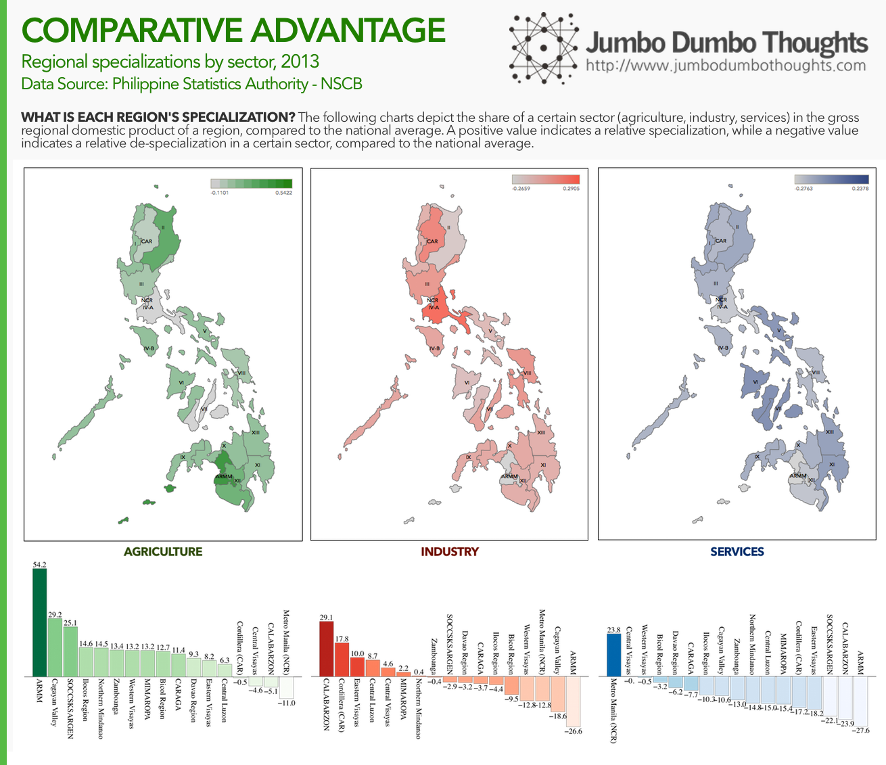
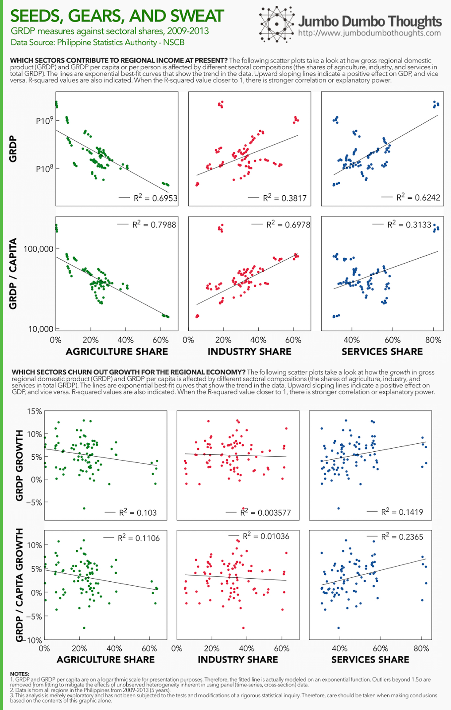

```{r fig.cap="(Photo: <a href='https://www.flickr.com/photos/storm-crypt/3051911226/in/photolist-Kpcuf-5DFQT5-Kuqty-6dDajp-4WP1Qq-ccjoME-b6QXye-4Zwy31-5Qtf9q-o4LgHB-4xFt2e-6DfCbX-4qg7m3-oXF7aN-4EHAxr-4X4iv1-9S62W-bjECgC-4yhBob-4xEYxB-3KgngK-344pk7-4zYg4V-4qc4EX-cNoMcL-8kENZT-kSEKmf-3Kgn8R-4WJJxX-4hAPKy-7WMK9m-6DjJjf-7N7axF-32NPAT-32Tn8d-83DxoU-9HZ91H-7zg3jE-aD6q6r-64Kzpe-3Kgn2B-6paHqo-3f56QE-5RCXED-9iDdjV-8DNg7k-9J1uqx-4MaALw-4M6qfp-3fjSdj' target='_blank'>Storm Crypt/Flickr</a>, <a href='https://creativecommons.org/licenses/by-sa/2.0/' rel='nofollow' target='_blank'>CC BY-SA 2.0</a>)", out.width="100%"}

```

## Overcentralization?

First, let's try to frame the overcentralization problem in data. One way to do that is through regional income accounts - particularly GRDP (gross regional domestic product) per capita - and see whether the NCR's measures far outstrip the rest.

```{r layout="l-body-outset"}

```

It seems that a certain level of centralization does exist, with GRDP per capita in Metro Manila at roughly 2.8x the national average, while the rest of the regions manage only from 0.2x to 1.4x the national average. Worryingly, the trend is getting worse, with NCR growing from 2.3x to 2.8x in the past twelve years, and the other regions actually falling in relation to the national average.

## Blame the government?

Many blame the government for allocating too much of the government's budget to NCR, but is such really the case? Let's take a look at how much each region produces, relative to the amount of government spending it receives. We use two measures: net giver/(taker) (GRDP share less budget share), and the contribution index (GRDP share/budget share). Details explanations of how the measures were constructed follow the graphs.

```{r layout="l-body-outset"}

```

Metro Manila is actually a significant net giver (contributes more to GDP than it takes in budget), and government spending is efficient in the region. Except for Southern Tagalog, all other regions are net takers (take more than they contribute) and are inefficient in the use of government funds.

There are two possible explanations: one is that Manila may actually be able to support more people and industry, and the other is that government spending in other regions may not be in the form of growth-generating assets such as transport infrastructure, electrification, or disaster readiness.

## Sectoral Specializations

What makes Manila's economy so different from the rest of the country? We can take a look at the sectoral shares of agriculture, industry, and services in each of the regions' economies to find out.

```{r layout="l-body-outset"}

```

Metro Manila is particularly specialized in services, probably due to the [burgeoning IT-BPO industry](/2014/02/philippine-it-bpo-industry.html). CALABARZON, on the other hand, is the industrial capital of the country. Other regions are geared much more toward agriculture.

Considering that services (BPO and retail trade) and industry (manufacturing) are currently the the highest growth and value sectors of the country's economy, it wouldn't be surprising that economic activity is concentrated in Metro Manila. But you don't have to take my word for it: let's see how different sectoral compositions affect GRDP, growth, and per capita values.

```{r layout="l-body-outset"}

```

Data for all regions from the past 5 years show that specialization in agriculture can cause the region to lag behind in regional income. This could mean that the country's landscape isn't appropriate for agriculture, or that the sector has failed to modernize and increase its productivity. On the other hand, regions focused on services or industry contribute much more to economic activity.

However, the data is much more fuzzy for growth. Only the services sector has even a nominal effect on economic growth for the region. This could mean that only the service sector is seeing demand right now, that industry and agriculture are not modernizing (R&D), or that infrastructure put in place by government does not support growth in industry or agriculture.

**There you go: a closer look at regional disparities in income, what they could mean, and how to view the country's economy beyond the capital.**

## Explore the data!

You can also take a look at the sectoral compositions in 2013 in much more detail through this interactive infographic! Let me know in the comments section if find anything interesting!

<iframe height="689px" id="tableauiframe" src="https://public.tableau.com/views/JumboDumboThoughts-DataExplorer-GRDPbyOrigin2013/DataExplorerGRDPbyOrigin?:embed=y&:showTabs=y&:display_count=yes&:toolbar=no" width="100%"></iframe>

Thanks for reading! If you found this post interesting, I'd appreciate it if you liked, shared, tweeted, or +1'ed it on your preferred social network. I'd also appreciate your thoughts in the comments section below. Data requests can be made through the contact form.
