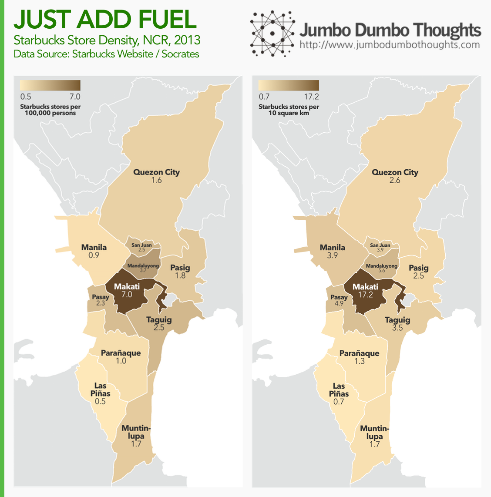

Coffee is probably one of the most underrated drivers of the economy, because its impact can be hard to measure. With a majority of the workforce and studentry regularly drinking coffee, it is hardly insignificant in an economy's productivity calculus.

## Starbucks Store Density 

Starbucks is easily the largest coffee chain in the country, with around 150 stores in Metro Manila. In comparison, the Coffee Bean & Tea Leaf, its closest competitor, chimes in at around 70.  

Data on Starbucks stores around Metro Manila provide an interesting picture of the 'coffee landscape' of the region. By mapping the addresses to specific latitude and longitude measures, we can plot the various coffee shops on a map and figure out where coffee drinkers are most likely to be found. We normalize the data by dividing by population and by land area for each city.  

```{r fig.cap="Darker areas indicate heightened Starbucks store density. (click to enlarge)", out.width="100%"}

```

Makati, being the region's central business district, unsurprisingly wins the title of coffee city in the metropolitan area, with around 7 stores per 100,000 people, and 17.2 stores per thousand hectares. What is surprising is that cities neighboring Makati have a high proportion of coffee shops as well, pointing to the possibility that the central business district is generating some spillovers. The laid-back southern cities of Paranaque and Las Piñas have the least amount of coffee shops.

## Map Explorer: Starbucks stores in Metro Manila 

If you want to find the closest store, you can use this interactive chart. Click on the circle representing the store to view more details. 

<iframe id="tableauiframe" src="https://public.tableau.com/views/JumboDumboThoughts-StarbucksinPH/StarbucksExplorer?:embed=y&:showTabs=y&:display_count=yes&:toolbar=no" height = "600px" width="110%"></iframe>

Thanks for reading! If you found this post interesting or enjoyable, I'd appreciate it if you shared, liked, +1'ed or tweeted it on your preferred social network, as well as shared your thoughts in the comments section below.   
