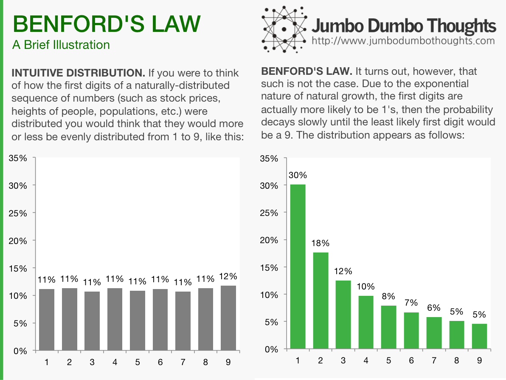
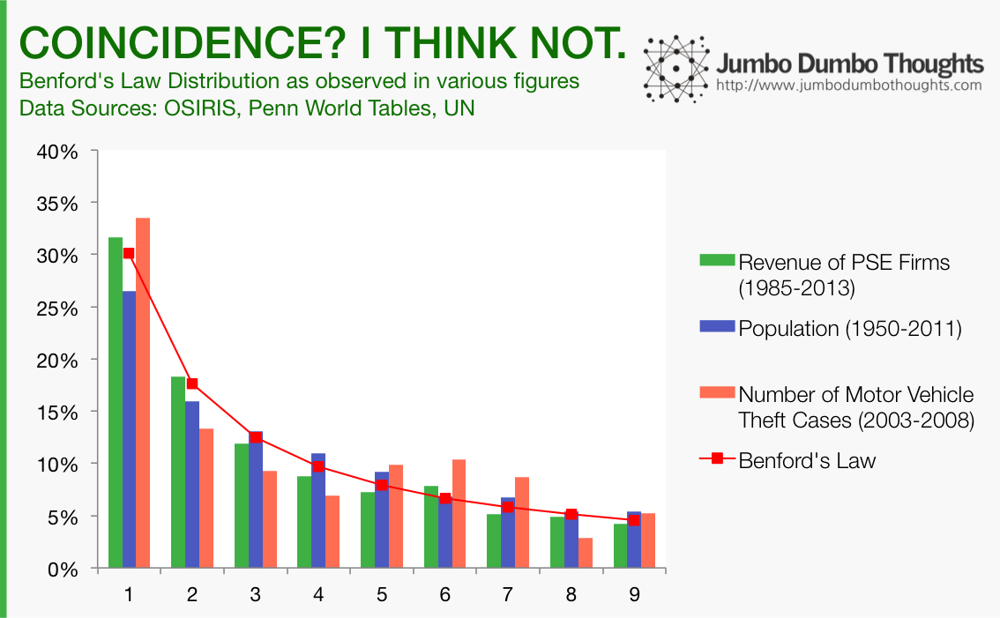
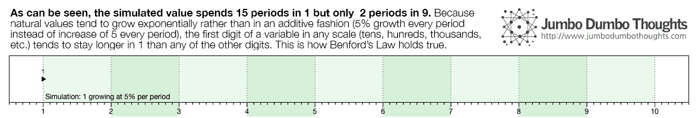
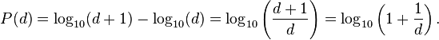

## Benford's Law: what is it?

Imagine you have a list of values, say, a list of credit card payments to a bank for an entire year. If you were to take the first digit of each of those figures, what digit would you think would be the most common? Intuitively, one would surmise that the random nature of these payments would mean that all digits from 1 to 9 are equally likely to come up as the first digit, but such is not the case. Digit 1 is actually most likely to come up as the first, while higher numbers are less and less likely.

```{r fig.cap="Figure 1. Benford's Law", out.width="100%"}

```

This property doesn't just apply to financial variables; it can apply to demographic and event-based data, as well. As an example, let's take the first digits of the operating revenue of all Philippine Stock Exchange-listed firms from 1985 to 2013, or the population of all the countries of the world from 1950 to 2011, or the number of motor vehicle theft cases from 2003-2008 and see how they are distributed:

```{r fig.cap="Figure 2. Benford's Law in nature.", out.width="100%"}

```

## Benford's Law: Why is this so?

It has to do with how numbers tend to grow.Real-world values, such as population, market capitalization, or revenue, grow in an *exponential* rather than *additive* manner. In other words, if I were to estimate their growth, it would be in terms of percentage growth (such as 5%, 10%) rather than a constant increase per period (such as 500 units per year). To demonstrate how this property of exponential growth translates to the above Benford's distribution, let's simulate a value that starts at 1 and grows at 5% per period:

```{r fig.cap="Figure 3. Exponential Growth favors 1's over 9's.", layout="l-body-outset"}

```

The value starts at a slow pace, since the base is quite small. It takes 15 periods before it is able to move towards 2 as the first digit. Then, as the base becomes quite larger, the jump becomes wider between periods, and the value takes less time to move to the next first digit. Another way to think about this is that to move from 1 to 2, the value would need to double (100% growth), while to move from 8 to 9, the value would only need to grow by 12.5%. This is why there are usually more 1's than 9's as the first digit in a naturally generated series.

<div class="uk-alert-primary" uk-alert>

If you were to condense this distribution into a mathematical function, the probability of a digit appearing can be computed as follows:

```{r fig.cap="Figure 3. Exponential Growth favors 1's over 9's.", layout="l-body-outset"}

```

(<i>This is just a technical note. For the actual expected percentages, just refer to the first graph.</i>)

</div>

## Applying Benford's Law to Bureau of Customs importation data

If the distribution described by Benford's Law prescribes what we can expect from *naturally-generated* data, then we can know when something is *not naturally-generated* (i.e. possibly fraudulent). If the first digits of a sequence of transactions do not conform to Benford's Law, then there is a risk that the sequence might have been tampered with.

Let's apply this theory to transactions we all know are kind of... fishy - import transaction data from the Bureau of Customs for January 2014. As part of its drive towards transparency, the BOC has regularly published import entries data. I chose January 2014 because customs reform was just starting back then and our chances of catching some risky transactions *might* be higher.

Before we delve into the application, I need to define one last concept: the Cho-Gaines Distance Statistic, which measures the 'distance' of a specific first digit distribution from the Benford's Law distribution. The higher it is, the less likely that the distribution under analysis is a 'Benford-distributed', and the more suspicious it is. For details on how it is computed, see these two papers:

* [[Paywalled] Cho, W. &amp; Gaines, B. Breaking the Benford Law: Statistical fraud detection in campaign finance. *The American Statistician 61*(3).](http://www.tandfonline.com/doi/abs/10.1198/000313007X223496#.VGixlcl-Wiw) - explains the Cho-Gaines distance statistic, its computation, and its application in the detection of fraud in campaign finance.
* [Morrow, J. *Benford's Law, Families of Distributions, and a Test Basis*](http://www.johnmorrow.info/projects/benford/benfordMain.pdf) - computes for the critical values for the Cho-Gaines Distance Statistic for a certain distribution to be considered out of conformity with the distribution prescribed by Benford's Law.

## Which products imported into the Philippines exhibit high fraud risk?

In the Bureau of Customs, imported goods are classified into numerical categories called HS Codes. The broadest categories of goods are 2-digit HS Codes, which go from 01 to 99. We group all import entries in January 2014 by 2-digit HS Codes, and see whether the first digits of the gross mass declared, dutiable value declared, or the duties and taxes paid conform to Benford's Law using the Cho-Gaines distance statistic (remember: higher distance = riskier):

<iframe height="569px" width ="100%" src="https://public.tableau.com/views/JumboDumboThoughts-BenfordsLawonCustomsData/DistanceperHSCODE?:embed=y&amp;:showTabs=n&amp;:display_count=yes&amp;:toolbar=no"></iframe>

The results seem to make sense in light of recent information. Government has recently <a href="http://www.mb.com.ph/govt-starts-probe-on-smuggled-expired-meat/" target="_blank">started a probe on smuggled expired meat</a>. The Philippine Center for Investigative Journalism voiced that <a href="http://pcij.org/stories/smuggling-is-killing-shoe-garments-textile-industries/" target="_blank">smuggling was killing the domestic shoe, garment, and textile industries</a>. One of the country's largest <a href="http://www.interaksyon.com/business/98291/philippines-5th-biggest-rice-importer-sued-for-smuggling" target="_blank">rice importers was sued for smuggling</a>. Nevertheless, the trend seems to be that imports with the most irregularity are those that are either agricultural raw materials or processed agricultural products.

Another interesting way to look at the data is to determine where the irregularity occurs - is it in the amount of goods declared, the valuation of said goods, or the duties paid for such goods? For 03 - Fish & Crustaceans, although the taxes paid may be good and proper, it may not be for all of the goods or all of the value. For 12 - Oil Seeds, Grains, Plants, and Straw, while the mass declared isn't suspicious (probably because of the way these products are measured), the valuation and the taxes paid are suspect. Feel free to explore the results, and share your thoughts in the comments! Better yet, you can use the interactive tool in the following section.

## Import Fraud Risk Investigation Tool

You can dig deeper and find suspicious patterns for yourself using this interactive tool. Simply select a measure (gross mass, dutiable value, or duties and taxes paid), and a category of goods (HS Code), and you can view the first digit distribution vs the Benford distribution, the suspiciousness or the distance statistic, and also the number of transactions for the product in the month of January.

<iframe height="580px" width ="100%" src="https://public.tableau.com/views/JumboDumboThoughts-BenfordsLawonCustomsData/HSCODEBrowser?:embed=y&amp;:showTabs=n&amp;:display_count=yes&amp;:toolbar=no"></iframe>

If you find any interesting HS Code-measure pairs, please take a screenshot and share your thoughts in the comments section.

## Explore the Data!

Just in case you want to take an ever deeper look at the data, you can view the individual first digit vs Benford plots for each HS Code and for each measure. Again, if you find anything interesting, please share it with us in the comments.

<iframe height="569px" width ="100%" src="https://public.tableau.com/views/JumboDumboThoughts-BenfordsLawonCustomsData/GraphperHSCODE?:embed=y&amp;:showTabs=n&amp;:display_count=yes&amp;:toolbar=no"></iframe>

There you go: import fraud risk measurement using Benford's Law. Who knew logarithms would ever be useful for statistical fraud detection?

**Thanks for reading! If you found this post interesting or otherwise useful, I'd appreciate it if you liked, shared, tweeted, or +1'ed this post on your preferred social network. Please feel free to share your thoughts in the comments section below. Data requests can be made through the contact form, after reading my content sharing policies in the Policies / FAQ page.**
