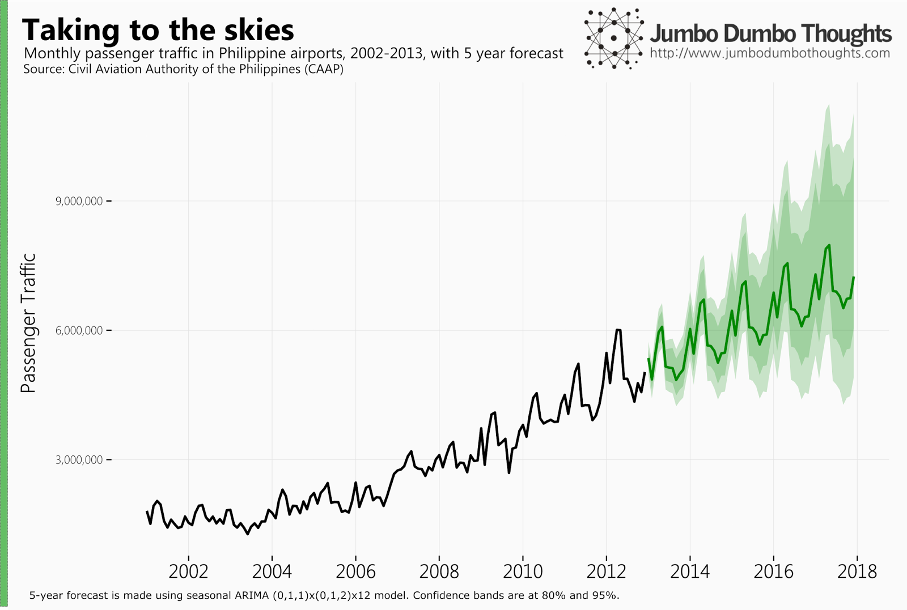
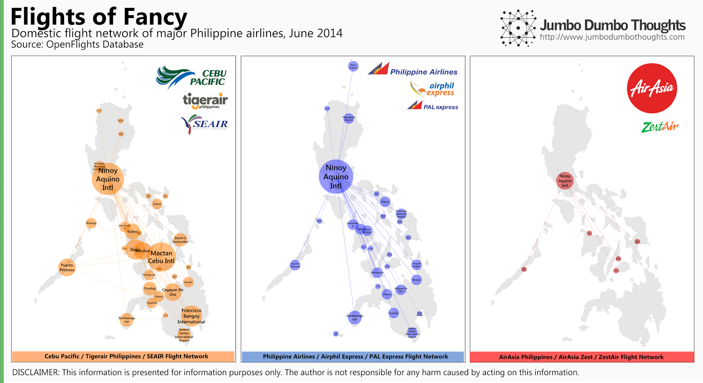
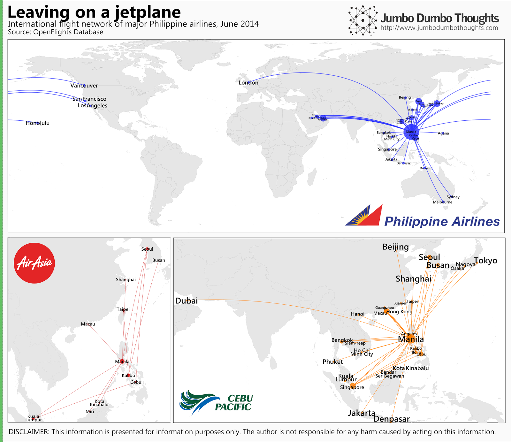
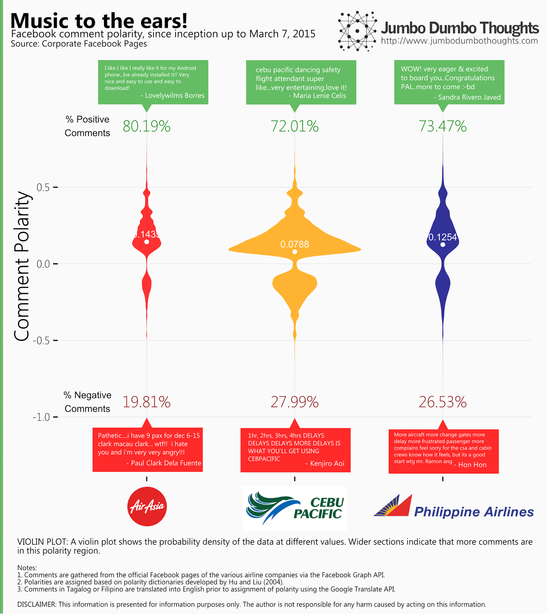
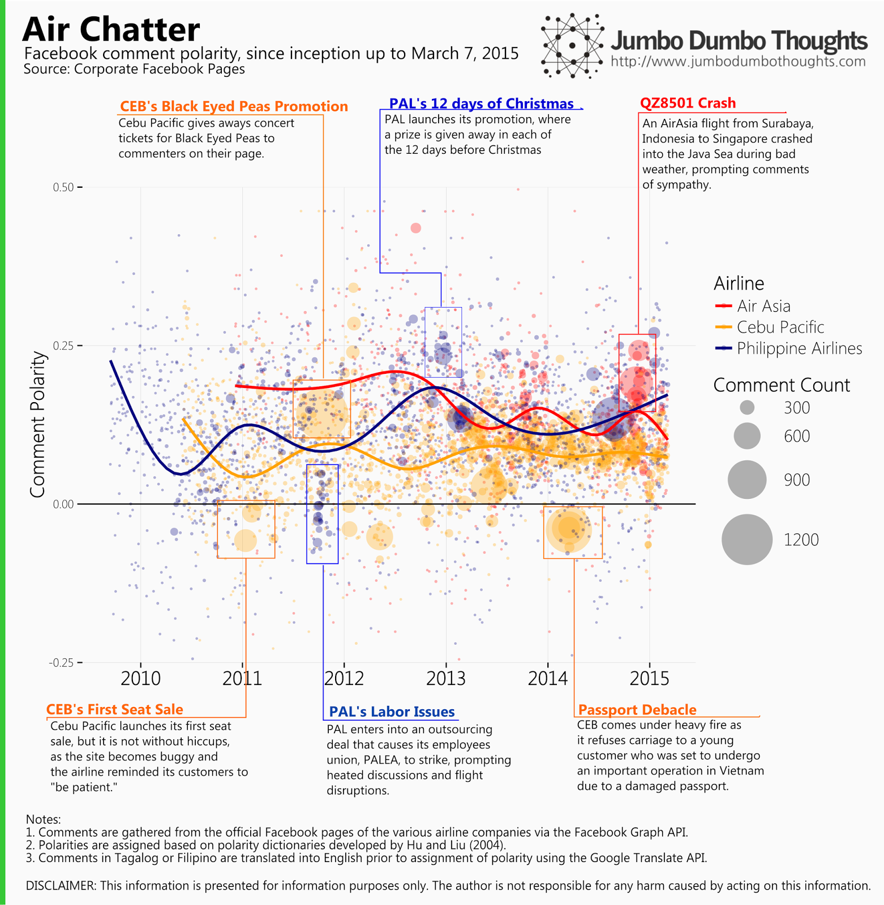

```{r out.width="100%"}

```

In recent years, the Philippine airline industry has experienced rapid growth, with more and more Filipinos getting to experience air travel for the first time. Not only that - the industry is in flux - fierce competition has caused churn and consolidation among the key players. We can take a closer look by analyzing their current flight networks, as well as performing sentiment analysis on comments on the airlines' official Facebook pages.
  
## Flight footprints
  
Using data from Openflights.org, we can map the flight networks of key players to get an idea of how wide or how narrow their service areas are. These key players include: (a) Cebu Pacific (which acquired Tigerair Philippines / SEAIR in January 2014), (b) Philippine Airlines and its budget counterpart PAL Express, / airphilexpress, and (c) AirAsia, which entered into a strategic alliance with ZestAir, formerly known as Asian Spirit, in March 2013.
  
We'll first take a look at domestic flight networks:

```{r layout="l-body-outset"}

```
  
Cebu Pacific seems to adopt a more decentralized hubs-and-spokes system arranged mainly around Manila, Cebu, and Davao, allowing for many direct flights between intermediate cities, whereas Philippine Airlines domestic operation is centralized in Manila, which means that travel between intermediate airports requires a layover in the capital. AirAsia's network is fairly limited, with only destinations in vacation areas in the Visayas. Cebu Pacific, with its low-cost and fairly welcoming marketing strategy, seems to have come to dominate domestic air travel in the country.<br /><br />What about international flight networks?
  
```{r layout="l-body-outset"}

```
  
It is clear that Philippine Airlines can still take Filipino to farther and more varied international destinations, reaching Europe, the Middle East, and the United States. Cebu Pacific seems to have focused on connecting not just to the capital cities of other Asian countries, but to key tourist and business destinations, similar to how it approaches domestic operations. AirAsia's network is limited to major Asian destinations.

Take note that the data contained in the Openflights database may contain discontinued routes or exclude new ones.
  
## Customer satisfaction: What Facebook users have to say

Taking a look at flight networks may be a good first look, but what if these large footprints are just for show? What if an overstretched fleet is causing customer dissatisfaction through delays and various other airport hiccups? We'll try to find some answers by mining comments the airlines' official Facebook pages, and applying [sentiment analysis](http://en.wikipedia.org/wiki/Sentiment_analysis) to determine customer satisfaction or dissatisfaction.

Sentiment analysis works by taking a statement (in this case, a Facebook comment) and assigning polarities - degrees of positivity or negativity) - to each word, and then crunching together the various polarities of the words in the sentence to create a polarity score that ranges from -1 (most negative) to +1 (most positive). Positive words such as "love", "thank" "wow", or "great" bring up the score, while negative words such as "delay", "hate", "frustrated", or "stupid" bring down the score. By assigning scores to 140,132 eligible comments, we can get an idea as to how satisfied or dissatisfied the airline's customers are. Duplicate comments, comments made by the airline itself, neutral comments, and spam comments are removed from the analysis. Comments in Filipino are automatically translated into English for proper tagging.

The violin plot below shows the polarities of the comments on the key players' Facebook pages. Wider areas indicate more comments in that particular polarity region. The average polarity score is represented by the white dots.

```{r out.width="100%"}

```

Cebu Pacific, with the largest plot, has the most active Facebook page, followed by PAL, then AirAsia. If you look at the top end of the distributions, you can see that all airlines have a distinct group of very positive comments, usually occurring during seat sales. If you look at the bottom end, you can see that only Cebu Pacific has a significant grouping of extremely negative comments. As a result, AirAsia has the highest polarity score, followed by PAL, and trailed by Cebu Pacific which has the most negative customer sentiment. Is this a result of poor operations, poor media management, or both?

We can discover some interesting trends and spikes if we perform the analysis through time. In the plot below, each dot is a day, the color represents the airline, and the size of the dot is the comment count. LOESS plots help you get a feel of where the data is going.

```{r out.width="100%"}

```

The interesting spikes, both upward and downward, are identified and annotated in the graph. On the trend aspect, it seems that PAL is on its way up, while Cebu Pacific has stayed consistently at the bottom of the ranking since 2012.

There you go: an alternative look at the airline industry through flight networks and social media analytics. Thanks for reading!

If you found this post interesting or otherwise useful, I would really appreciate it if you could like, share, tweet, or +1 this post on your preferred social network. I would also appreciate your thoughts in the comments section below.

Data, computation, and code requests can be made through the contact form. Please make yourself familiar with content, comment, and copyright policies by reading the Policy page.

<div class="uk-alert-warning" uk-alert>
DISCLAIMER: The above content is presented purely for information purposes only. The author cannot be held responsible for any harm caused by acting based on this information. The views expressed herein are the author's personal views alone, and are not borne out of any professional affiliation. All data and/or information presented above either publicly available or gathered by the author through personal means.
</div>
