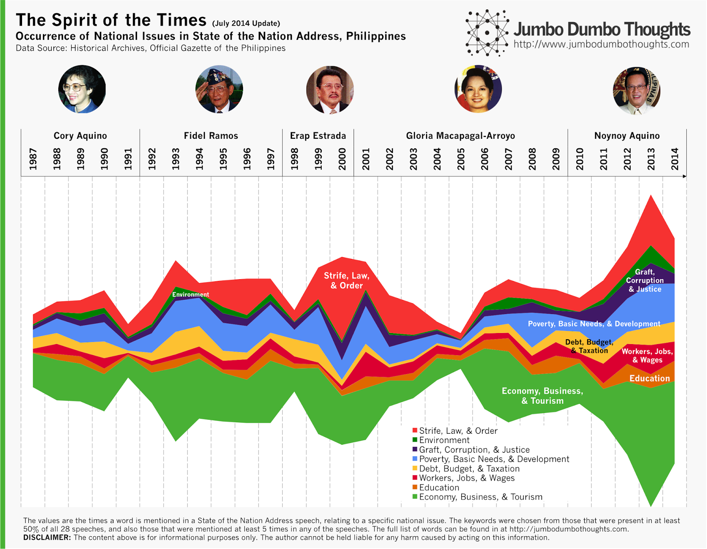
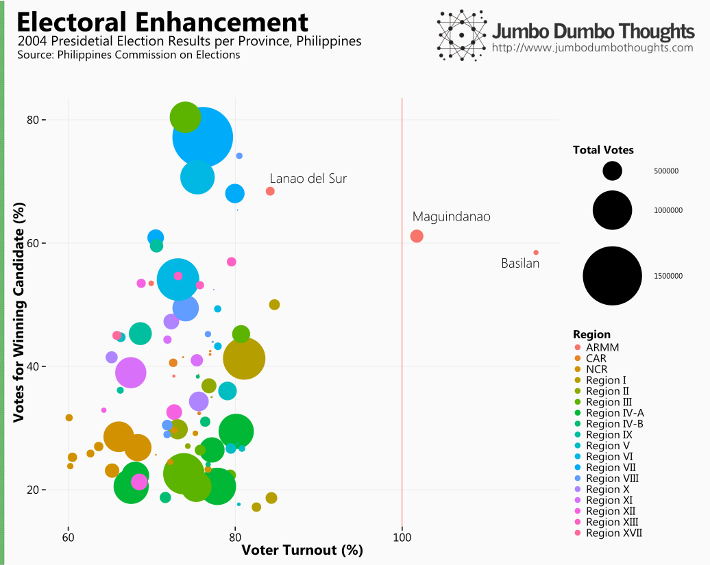
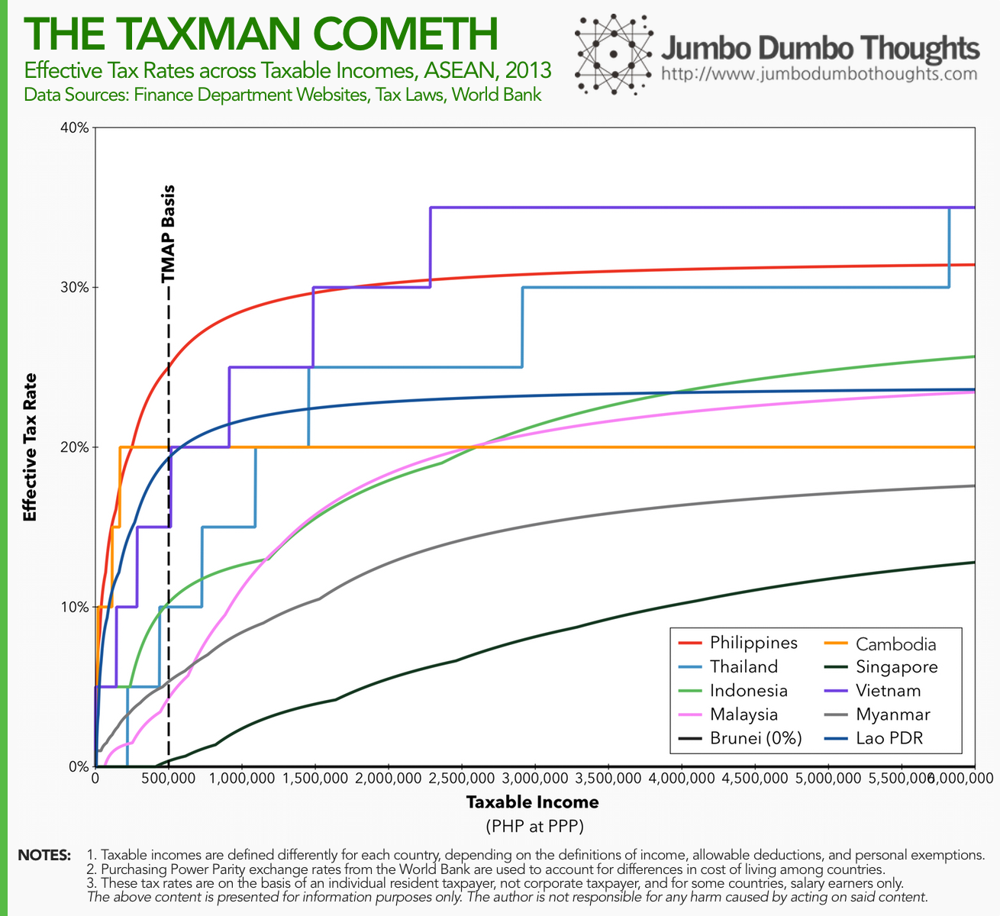
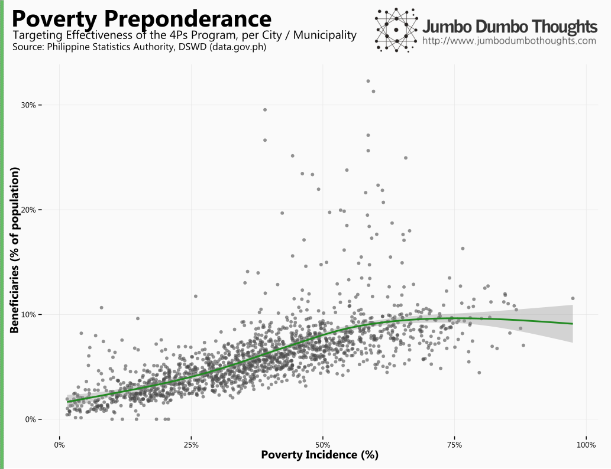
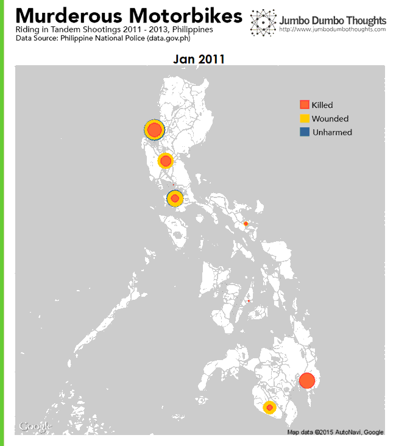
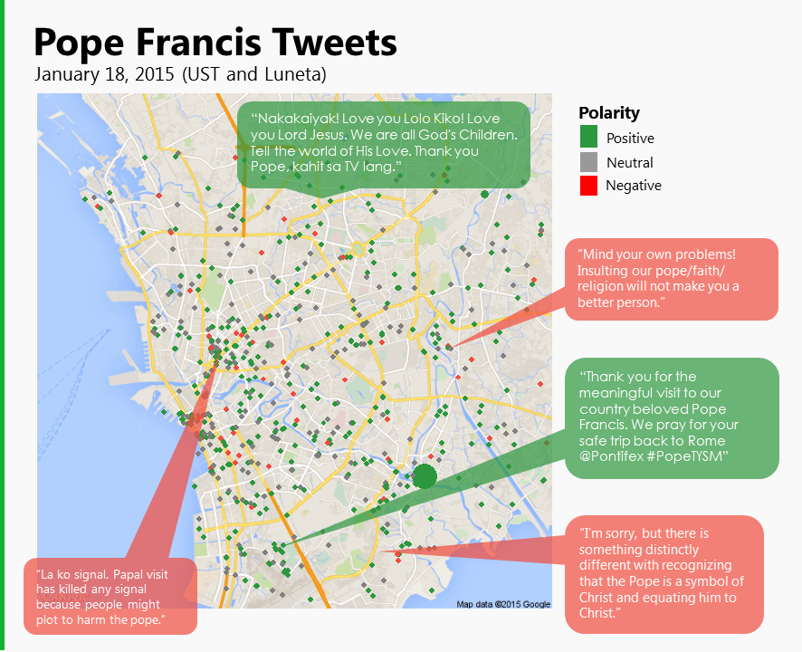
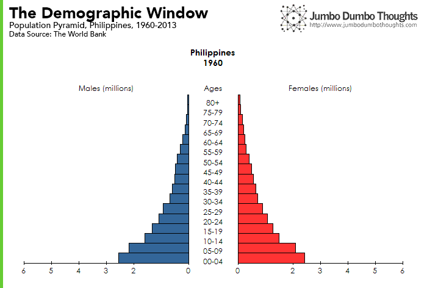

<iframe width="560" height="315" src="https://www.youtube-nocookie.com/embed/VyeV_8mYd1Q" frameborder="0" allow="accelerometer; autoplay; encrypted-media; gyroscope; picture-in-picture" allowfullscreen></iframe>

I was given the opportunity to speak on the power of data in a recent TEDxDLSU conference, with the theme "[Youth Kaleidoscope](http://www.tedxdlsu.com/tedxdlsu-youth-kaleidoscope/)". I decided to speak on three aspects of a "data mindset," that I believe is sorely lacking in the way business and governments make decisions, and that the youth of today can pioneer as they take leadership positions in the country. In this post, I'll just delve into detail regarding the visualizations presented during the talk.

## Data is just a collection of stories

Many people think of data as simply numbers on a spreadsheet, when it is real-life stories that truly matter. It would be worthwhile to consider that data is actually a collection of stories, except that these stories are collected and standardized in a way that allows one to see the entire picture, without looking at each individual story in turn. In this manner, we can expand our scope to a few stories, to the voices of everyone in the population.

For example, this graph of presidential priorities that I've shown in a [previous blog post](/2014/08/sona-words-july-2014.html) shows how each individual SONA can be compressed into a measure and compared against all the others, at least in terms of the national issues that each speech tackles.

```{r fig.cap="<a href='/2014/08/sona-words-july-2014.html'>original blog post</a>", out.width="100%"}

```

Given the power of data to expand the scope of decision-making, what can we do to harness it? Businesses and governments need some degree of what I call the 'data mindset,' which is simply allowing the dataset to guide one's decision-making mindset (as Hans Rosling might put it.) There are three key aspects of this mindset:

## 1. Recognize the limits of intuition and personal experience. 

The first aspect of the data mindset is to realize that what one sees, hears, and experiences, although valuable, rarely encompasses the entirety of the story at hand. This is why collecting data from diverse sources is necessary to gain perspective.

### 2004 Presidential Elections in ARMM

Consider the 2004 presidential elections: In this chart, I've plotted the share of the votes of the winning candidate against the voter turnout in each province.

```{r out.width="100%"}

```

Three provinces in the ARMM have a very high share of votes for the winning candidate, while the turnout has reached impossible levels. How can this be? As I've explored in a [previous blog post](/2014/03/fraud-and-fake-ballots.html), this might signal the presence of vote padding as a means for electoral fraud. Up to now, [these specific areas in 2004 are still under investigation for poll cheating](http://www.gmanetwork.com/news/story/235724/news/nation/comelec-exec-grilled-on-alleged-2004-poll-cheating-in-armm).

### Benford's Law on Customs Data

Benford's Law provides another example of how intuition may fail to approximate reality. If one were to simulate a certain series of numbers, such as the dutiable values of imported goods, one would assume that the first digit has an equal chance of being 1 throughout 9. However, because numbers grow exponentially and not additively, 1's tend to be more common, then 2's, and so on.

```{r fig.cap="<a href='/2014/11/benfords-law-customs-imports.html'>original blog post</a>", out.width="100%"}
knitr::include_graphics("images/20150405-benfords-law-normal.png")
```

I've featured three types of goods during the talk: (a) those that conform to the distribution (Books, papers, magazines), (b) those that are iffy (cotton and fabrics), and (c) those that are alarming (meat and meat offal). You can view them in the following interactive chart.

<iframe height="614px" width="100%" id="tableauiframe" src="https://public.tableau.com/views/JumboDumboThoughts-BenfordsLawonCustomsData/HSCODEBrowser?:embed=y&amp;:showTabs=y&amp;:display_count=yes&amp;:toolbar=no"></iframe>
  
You can see that, contrary to intuition, generating a series of fake entries isn't as straightforward as picking and choosing any which digit one would like. While this isn't prima facie evidence of fraud, it may be indicative of possible [textile](http://www.abs-cbnnews.com/business/02/27/15/p21-m-worth-smuggled-ukay-ukay-korea-seized) or [meat](http://business.inquirer.net/182283/p4b-duties-1m-jobs-lost-due-to-pork-meat-smuggling-agri-group) smuggling.
  
## 2. Accept that the conclusions you reach might not be those you originally set out to obtain
  
The second aspect of the data mindset is basically an open mind. Whereas many inquiries are borne out of the need to confirm or disprove a certain a-priori expectation, these expectations should, at any time, be subject to scrutiny once the evidence points a different way. 

### Buses in EDSA
  
Buses seem to get a lot of flak for causing traffic jams along Manila's main highway. However, a close inspection of the numbers reveals that a solution would require more than just a bus ban.  

```{r fig.cap="<a href='/2013/10/traffic-jams-private-vs-public.html'>original blog post</a>", out.width="100%"}
knitr::include_graphics("images/20150405-people-not-cars.png")
```
  
If close to 90% of people squeeze into half of the road space along EDSA through public transportation, I would find it easier to forgive a bus the next time it cuts me off. 

### Taxes in the ASEAN
  
Another example is when I set out to disprove the notion that Filipinos pay the highest tax rates in the ASEAN, thinking that using only a taxable income of P500,000 was insufficient to say so. It turns out, though, that they were right, except for the very high income levels.   

```{r fig.cap="<a href='/2014/08/philippines-taxes-tmap.html'>original blog post</a>", out.width="100%"}

```
  
The Filipinos really are getting the highest tax burdens, after all ([evasion and avoidance notwithstanding](/2013/10/tax-evasion-philippines.html).)    
  
## 3. Listen inclusively
  
I believe that the power of data is in its ability to consolidate a lot of information and deliver it to the decision-makers in a compact and actionable manner. In a country ridden with poverty and inequality, giving a voice to the underrepresented through data can make a big difference.
  
### Pantawid Pamilyang Pilipino Program
  
The first example was analyzing the targeting performance of the government's flagship anti poverty program - the Pantawid Pamilyang Pilipino Program, on a city/municipality level. By listening to the story of each individual city or municipality, we can get a grasp of which areas are being over- and under-served. Headline statistics, such as the total number of beneficiaries or total cash disbursed, would not capture this information.  

```{r, out.width="100%"}

```

It seems that targeting has been pretty good, with beneficiaries being more concentrated on areas with high poverty incidence. (Erratum: In the video I used beneficiaries as a percent of total beneficiaries, and the notion that targeting was unsatisfactory turned out to be incorrect when a better measure of targeting intensity, beneficiaries as a % of population, was used.)

### Riding-in-Tandem Shootings

Listening inclusively may also involve knowing what to be alarmed about. The following is an animated plot the recorded riding in tandem shootings around the country from 2011 to 2013.

```{r, out.width="100%"}

```
  
2,751 people killed, 1,593 people wounded, and 385 failed attempts are presented across three years. Listening inclusively allows us to see that riding-in-tandem shootings are not just one-off occurrences but a rather terrifying nationwide phenomenon. 

### The Filipino Twitterverse during Pope Francis' Visit

Lastly, we can use social media to listen to the stories of people in Metro Manila during the visit of Pope Francis last January of 2015. Each tweet is a story that reflects the myriad reactions to the presence of the leader of the Catholic church.  

```{r, out.width="100%"}

```
  
News articles cannot possibly report on the different reactions. Delving deep into the Twitter data can expose many different Filipino viewpoints during the time.        
  
## The hero generation
  
I was asked to talk about the hero generation, so I decided to end the speech with the demographic window. It may not sound exciting, but this could mean actual sustained economic growth for the Philippines. The demographic window is a time when the working age population becomes large relative to dependents - senior citizens and children. With an expanded labor force, the economy naturally receives a boost of growth. Let's take a look at the population pyramid for the Philippines since 1960.  

```{r, out.width="100%"}

```

The country has always had a very young population, but the pyramid has started to 'taper', meaning the bulk of the population is moving up, towards the working age group. This could mean the Philippines' entry to the demographic window and an opportunity for the upcoming generation to be the hero generation.

Thanks for reading! If you found this post interesting, I'd appreciate it if you liked, shared, tweeted, or +1'ed it on your preferred social network, or shared your thoughts in the comments section below. Data, code, and computation requests may be made through the contact form.
