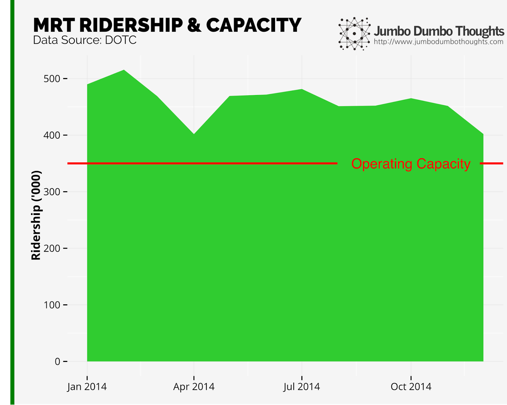
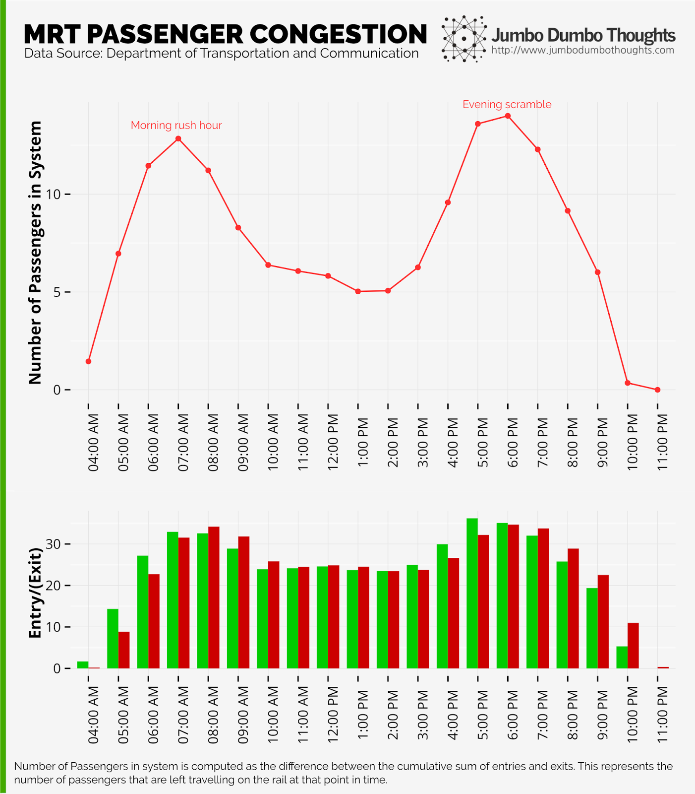
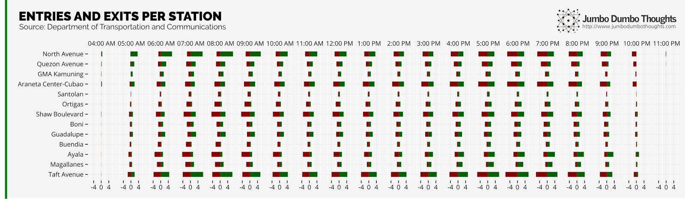
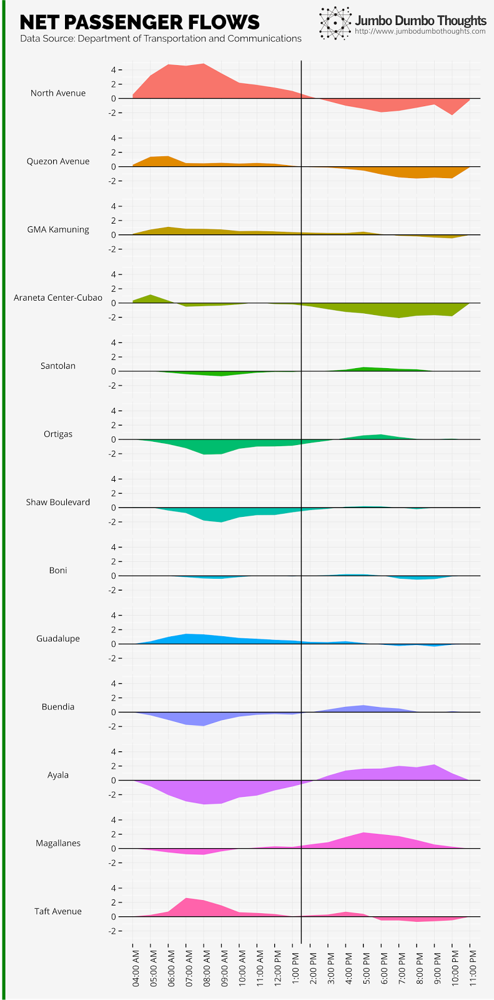
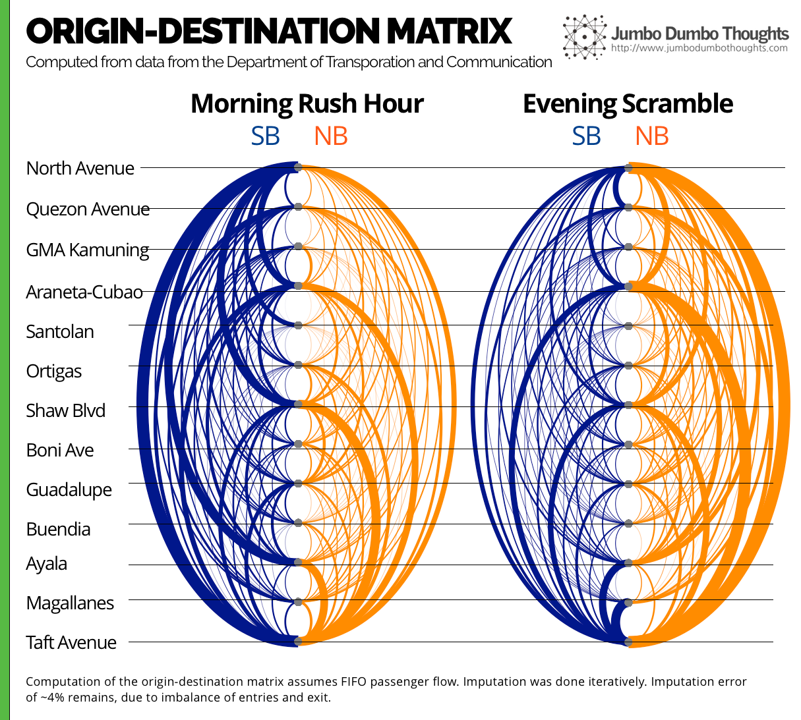
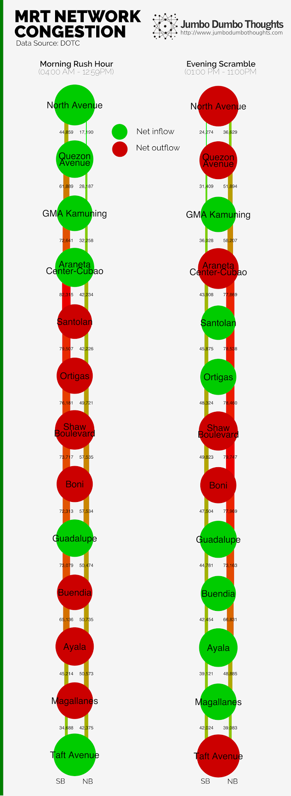

This article was also featured on [Rappler](http://www.rappler.com/views/imho/93492-mrt-capacity-conundrum-data-research) and [GMA News Online](http://www.gmanetwork.com/news/story/490510/scitech/science/on-the-mrt-a-capacity-conundrum)!

After more than 16 years in operation, it is clear that [the MRT isn't anymore what it once was](http://www.rappler.com/views/imho/93152-manila-mrt-awesome). What used to be an enduring symbol of progress and technological innovation is now just an uncomfortable, [accident-prone](http://newsinfo.inquirer.net/628821/mrt-train-derailed-report), and unfortunately, inevitable mode of transport. Operating at the level of about 500,000 passengers per day on a capacity of only 350,000, transport secretary Abaya says the trains [continue to be worn down](http://www.abs-cbnnews.com/nation/metro-manila/02/26/14/abaya-mrt-3-operating-over-capacity) from the excessive burden.

## Too close for comfort

```{r fig.cap="MRT Ridership - Continuously operating at above capacity is sure to bring undue wear and tear to a system that hasn't seen any major overhaul since it was built.", out.width="100%"}

```

I've written before on [the state of train lines in the capital](/2014/01/trains-and-tribulations.html), but new data from the Department of Transportation and Communications (DOTC) has surfaced, allowing us a more detailed look at the inner workings of the historic MRT.

## It's best not to go with the flow

Ridership isn't going to be evenly distributed throughout the operating day, so an adequately-planned facility requires a little slack capacity to handle the peak hour load. When this isn't the case, passengers tend to build up inside the system, and congestion ensues.

```{r fig.cap="MRT Passenger Congestion - 7AM and 6PM are the worst times to hop onto the MRT.", layout="l-body-outset"}

```

The numbers here seem quite intuitive - during peak times, the system is taking on more people that it can output, and the number of people that are left inside the train system increase. This peak is most apparent in the morning at around 7am, and also in the evening at 6pm. So, if you regularly take the MRT to work or school, it would be best to have a schedule that takes you away from commuting at these times. It might also be useful to know that the traffic load doesn't taper off until you move ahead or behind at least two hours from these peak times.

From a systems point of view, it would seem that creating differential work/school shifts would greatly help even out the workload and hopefully make it easier for everyone. The MRT already runs more trains during peak periods, but it seems that even the absolute maximum capacity isn't enough.

## Not all MRT stations were created equal

```{r layout = "l-page", fig.cap="Station-level traffic - At different times of the day, some stations serve as key entry points, some as exits, and some are even all throughout. Green bars are entries; red bars are exits."}

```

When analyzing capacity, we not only have to look at the time-based load, but also the differential load on different stations. Let's first take a look at the chart above. North Avenue, Araneta-Cubao, Shaw, Ayala, and Taft, being key points around the train line, are much busier than the others. Santolan and Buendia station, on the other hand, don't seem to serve that many customers, possibly because they are too close to some major stations.

```{r out.width="100%"}

```

You may also catch the fact that not all stations serve the same load throughout the day. Some stations near residences serve as entry points during the day, and others are the opposite.

Such a phenomenon is more clearly illustrated in the chart on the left (click to enlarge). Stations near residences and north/south entry points (North Avenue to Araneta Center, Guadalupe, Taft Avenue) have more people coming in that leaving during the day when people are heading to work. Other stations, near workplaces (Santolan, Ortigas, Shaw, Buendia, Ayala, Magallanes), have more people disembarking during the morning rush hour. At around 1pm, the pattern for all of the stations flip, when people begin to return to their homes.

Taft Avenue and North Avenue are among the busiest stations, indicating that much of the workforce is already living beyond the reach of the MRT. In order to serve more people, extensions will have to be considered for the combined train system, but that's when capacity isn't such a problem anymore.

Poor urban planning might also be at play here: the uneven zoning of residential vs commercial might cause uneven concentrations of passengers, further increasing the peak-hour load.

## Origins and Destinations

Since we had the entry and exit data per hour, I imputed the origin-destination matrix, i.e. the pairs of origins and destinations for each person riding the MRT. By taking a more detailed view, we can see the particular routes that people would usually take and how we can optimize around them.

```{r fig.cap="Origin-Destination Matrix - The arcs represent the number of people from the particular origin-destination pair. Orange arcs are northbound trips, and blue arcs are southbound trips. Stations are arranged from north to south.", layout="l-body-outset"}

```

```{r out.width="300px"}

```

During the morning, the key routes are those to Ayala, Shaw, and Taft, whereas Taft, Araneta-Cubao, and North Avenue become key destinations in the evening. Although the MRT has no way in which trains can bypass each other (except for the stations in Taft, North Avenue, and Shaw), trains that do not stop at every station, but rather focus on serving busy origin-destination pairs might be feasible if such a method of bypass can be created.

If we further extrapolate by imagining the throughput at each rail section, we can reveal the "weakest links" in the system. On the left (click to enlarge), we can see that the central stations are under a lot of strain on the southbound rail during the morning, and on the northbound rail at night. Additional load from the upcoming south rail extension should be considered, because passengers that transfer onto the line will increase the load.

Having some trains skip some stations in this area should speed up the system, but only if trains were allowed to bypass each other. Then again, if capacity is really the issue, there is little system reengineering would do.<br /><br />There you go! A closer look at our ailing MRT system. I realize that I'm no train expert, so please help me make sense of the data by commenting below.

Thanks for reading! If you found this post interesting, I would appreciate it if you shared, liked, tweeted, or&nbsp;+1'ed it on your preferred social network, or also shared your thoughts in the comments section below. Data, code, and computation requests can be made through the contact form.

## Data Links

  * [DOTC - Daily Passenger Traffic](http://dotc.gov.ph/images/front/Data_Sets/MRT3-DailyPassengerTrafficperHourperStationforCY2014.xlsx)
  * [DOTC - Monthly Passenger Traffic](http://dotc.gov.ph/images/front/Data_Sets/MRT3-MonthlyPassengerTrafficperStationforCY2014.xlsx)

## Disclaimer 

The views and opinions expressed herein are those of the author only, and do not relate to any personal or professional affiliation. The content above is presented for information purposes only and the author cannot be held responsible for any harm caused by acting on this information without prior consultation.

<iframe src="https://www.facebook.com/plugins/post.php?href=https%3A%2F%2Fwww.facebook.com%2Frapplerdotcom%2Fposts%2F978910982129685&width=500" width="500" height="482" style="border:none;overflow:hidden" scrolling="no" frameborder="0" allowTransparency="true"></iframe>

<iframe src="https://www.facebook.com/plugins/post.php?href=https%3A%2F%2Fwww.facebook.com%2Fgmanews%2Fposts%2F10153056736651977&width=500" width="500" height="501" style="border:none;overflow:hidden" scrolling="no" frameborder="0" allowTransparency="true"></iframe>
