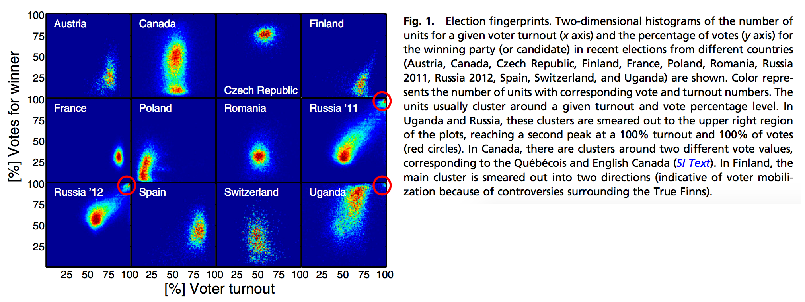
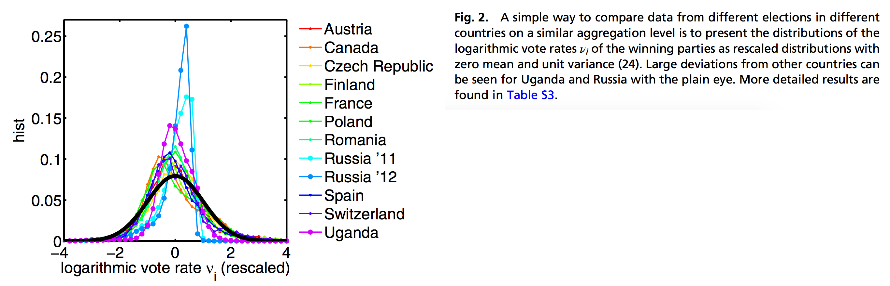

## Election data geekery

For the first time, the data geeks have finally gotten some love. Highly detailed elections results, broken down all the way to the precinct level, have been [published online](http://pilipinaselectionresults2016.com) by the Commission on Elections (COMELEC) as well as poll watchers and the media.

There are many things I imagine we could do with this data, but one of the most popular uses is to assess the risk of elections irregularities. For the first few parts of this series, we'll try to carefully and scientifically assess the risk of election irregularities.

Going back to the methodology highlighted in [a 2014 post](/2014/03/fraud-and-fake-ballots.html), part 1 of this series will focus on detecting elections irregularities through vote padding, defined as the adding of fraudulent votes into the count to increase a candidate's probability of a win, or, conversely, the shaving of legitimate votes from the count to decrease a candidate's probability of a win.

## Statistical detection of vote padding

Vote padding, sometimes called ballot stuffing, is a form of electoral fraud that involves adding fake votes or shaving legitimate votes to favor a particular candidate. This is not be detectable in the final aggregated election results. However, if vote padding only occurs in a subset of jurisdictions it can change the distribution of voter turnout and vote share in a way that allows detection from granular election data.

This method was demonstrated in this [PNAS Paper](http://www.pnas.org/content/109/41/16469.short)[@Klimek_Yegorov_Hanel_Thurner_2012], where they showed that Russian and Ugandan elections, known to be marred with electoral fraud, contained 'election fingerprints' that we smeared towards the top left:

```{r out.width="100%"}

```

**Let's think about this: what happens when fake votes are added to the count?**

  1. **Increase in voter turnout** - because there are now more voters than actual, there is an increase in the % of voters that voted in particular cities/municipalities.
  2. **Increase in candidate vote share** - the favored candidate will see an increase in the percentage of votes won.

When you have a significant proportion of areas that have this high turnout, high vote share combination, there is an increased risk that electoral irregularities have occurred.

If we replicate this analysis for our elections, we find that there isn't anything that jumps out immediately. You can explore the plots in the following section:

<div class="l-body-outset uk-card uk-card-body uk-card-default" style="margin-bottom: 30px;">
<h3 class="uk-card-title" style="margin-top:10px;">Election Fingerprint Explorer</h3>
<div class="uk-text-meta">
How to read the chart: </strong>Select a race to view the "election fingerprints" for each candidate in that race. Dots represent a city/municipality, and the contour lines are intended to highlight suspicious groupings toward the top right corner. You can click on each image to enlarge.
</div>
<ul uk-tab>
    <li><a href="#">President</a></li>
    <li><a href="#">Vice-President</a></li>
    <li><a href="#">Senator</a></li>
</ul>
<ul class="uk-switcher uk-margin">
<li>
<a href="https://raw.githubusercontent.com/tjpalanca/ph-elections-2016-analysis/master/output/01-fig-fingerprint-president.png">

</a>
</li>
<li>
<a href="https://raw.githubusercontent.com/tjpalanca/ph-elections-2016-analysis/master/output/02-fig-fingerprint-vice-president.png">

</a>
</li>
<li>
<a href="https://raw.githubusercontent.com/tjpalanca/ph-elections-2016-analysis/master/output/03-fig-fingerprint-senator.png">

</a>
</li>
</ul>
</div>

For the presidential race, nothing seems to be out of order, as most of the fingerprints are concentrated around a central mass and with minimal 'smearing.' For the vice presidential race, you can see a bit of bimodality in terms of the winning percentage for <code>MARCOS, BONGBONG</code>, but the voter turnout is not high enough to cause 'smearing'. This is a symptom of a polarizing candidate -- some areas voted heavily for the candidate, and some did not at all. For the senatorial race, nothing is out of order.

What if the fraud was not as widespread, and it is not immediately detectable by a simple visual inspection? Perhaps, constructing a single index of vote padding risk can allow us to tease out the subtle differences.

## Creating a vote padding risk score

The authors of the PNAS[^Klimek_Yegorov_Hanel_Thurner_2012] paper have devised a simple logarithmic transformation for the vote counts.  The distribution of this transformed variable is most likely to be normal (i.e. bell-shaped) for elections with minimal irregularity. Details of this transformation are outlined in the [notes](#logarithmically-scaled-vote-count). As expected, logarithmic vote counts from the Russian and Ugandan elections show highly negative skewness and highly positive kurtosis, inconsistent with a normal distribution that has skewness and excess kurtosis of 0.

**So what does it mean in this case?** When we compute the skewness and kurtosis of the logarithmic vote counts, the further they are from 0 (negative skewness and positive kurtosis), the higher the risk of vote padding. Computing these values for all national-level candidates, we can construct the following chart:

**How to read this chart:** The closer the values are to the top left corner, the higher the risk of vote padding.

```{r}
knitr::include_url("figures/20160527-skewness-kurtosis-chart.html", height="500px")
```

Apart from a few party list and senatorial candidates that have understandably strong vote shares in one particular group of cities/municipalities but fall extremely flat in others (`BALIGOD, LEVITO`, `ALONA`, `KGB`, `ANG KASANGGA`), there seem to be no particular candidates that stand out.

## What does this mean?

Let me be clear: **This does not mean that there was no electoral fraud - it simply means that the risk of fraud through this particular form - vote padding or ballot stuffing - is significantly low.** Remember, data cannot serve as definitive proof -- it can only guide investigation and quantify risk. I highly encourage you to go through these [important caveats](#important-caveats).

## Important caveats

I've used careful language in presenting this analysis, and that's mainly to avoid misinterpretation; these elections have been very heated, both between candidates and among the general public. I have to make certain things clear:

  1. Statistics can't prove nor disprove fraud. At the most, it can assess the risk of fraud and guide investigation.
  2. The results of an analysis should be taken in the context of its scope, limitations, and assumptions. Sometimes, these are more important than the findings themselves.
  3. Just because this particular analysis shows/does not show signs of electoral irregularity, does not mean that there was/wasn't fraud committed. Each analysis is designed to detect a particular kind of fraud only.

### Data notes

  * The data was scraped from the [COMELEC's public election results page](http://pilipinaselectionresults2016.com/), as of May 25, 2016. At that time, 96.69% of election returns were transmitted, and 99.93% of city/municipality certificates of canvass were received. For a full list of cities and municipalities that have no results see [here](https://raw.githubusercontent.com/tjpalanca/ph-elections-2016-analysis/master/output/05-results-transmission-status.txt).
  * Data, code, and computations are available on [Github](https://github.com/tjpalanca/ph-elections-2016-analysis).

## Technical notes

### Logarithmically scaled vote count

The logarithmically scaled vote count $v_i$ is computed as follows:

$$v_i = \log{\frac{N_i - W_i}{W_i}} \hspace{0.4cm} \forall \hspace{0.4cm} W_i > 0, N_i > 0, N_i \neq W_i$$

This approach naturally removes cases where the voter turnout is greater than 100%, and also when there is a complete win (100% winning percentage). Therefore, this measure is actually conservative because it eliminates the extremes. This scaled vote count $v_i$ is approximately normal when the election results to not contain irregularities due to vote padding.

```{r out.width="100%"}

```

We can therefore quickly assess which candidates have the higher likelihood of vote padding by observing the distance of their moments (skewness and excess kurtosis) from the expected values of a normally-distributed random variable (when $X \sim N(0,1)$$, $$Sk_X = 0$$ and $$K_X = 0$). We could go further by computing their Jarque-Bera Test values, but we are parking that for the sake of simplicity.

> This post also appears in [GMA News!](http://www.gmanetwork.com/news/story/568132/scitech/science/on-the-elections-part-1-election-fingerprints)

<iframe src="https://www.facebook.com/plugins/post.php?href=https%3A%2F%2Fwww.facebook.com%2Fgmanews%2Fposts%2F10154014732386977&width=500" width="500" height="501" style="border:none;overflow:hidden;" scrolling="no" frameborder="0" allowTransparency="true"></iframe>
