**This is a contributed post from Carl Dominick Calub of TALAS Data Intelligence**

It's Fête 2016!

For you who have just heard about it, you can visit [their FB page](https://www.facebook.com/fete.dela.musique.philippines/) to know if you should know about it. The gist is music-lovers the world over celebrate Fête dela Musique --- World Music Day --- in June every year. In the Philippines this year, the 22nd Fête will be held on 18 June 2016 in Makati.

Where in Makati? EVERYWHERE. It's the ultimate bar-hopping event for audiophiles! Multiple gigs called *pocket stages* are set up in different bars. Each stage showcases a different genre. This year, there will be 21 pocket stages. That means 21 different genres!

There are also two *main stages* that play alongside the pocket stages for those who don't fancy spelunking around Makati. While each pocket stages is dedicated to a specific genre, the main stages feature a more diverse lineup of artists.

The main stages serve as convenient samplers of the different music themes. But the pocket stages are more interesting for people not just because they offer a more immersive experience, but also because there's a problem to solve. If you can visit all 21 gig locations, then you can enjoy your share of concerts for the year. The cherry on top: you don't have to pay a single peso!

With that many stages, it can be a very daunting task though. So how do we make it easier? Let's follow the data.

## Pocket Stages

The map below shows the locations of all the pocket stages for Fête 2016.

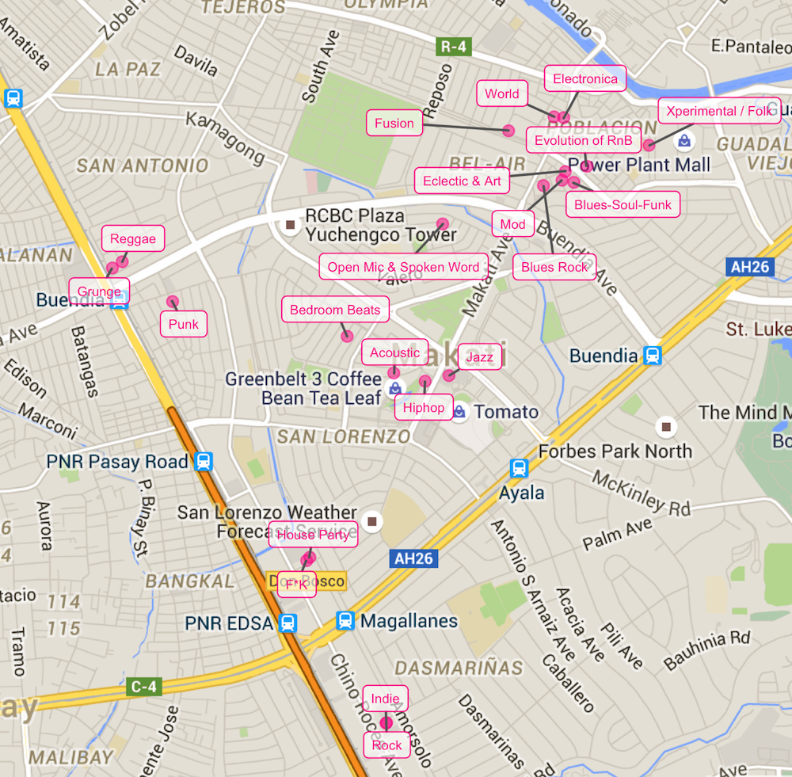

The map is useful in two ways: (1) As of writing there is no map of all the stage venues, and (2) immediately obvious is how some pocket stages are more accessible from other pocket stages.

The second point raises an interest in what route across the pocket stages should we follow so that time and energy are not wasted on walking. So that we can stay in the host bars longer and enjoy the music more.

The operations research (OR) practitioners among you may have immediately identified this as a *traveling salesman problem (TSP)* (or a *vehicle routing problem (VRP)*). The TSP and the VRP are well-studied problems, and there are established algorithms to solve for the optimal path.

Most of these methods, however, suppose that the salesman or the vehicle have to return to the starting point. We don't. Although you can include your home (or maybe your office, I don't know you) to the set of locations so that the problem becomes the optimal path from your home, through the stages, and back home. But I am not an OR specialist, and I'm not paid to do this.

We'll instead tackle the problem less formally. We'll use a smorgasbord of methods instead to not so much as to find the optimal path but just a convenient path. After all, our motif for today is variety.

## Stage Zones

First order of business is to group the pocket stages together: which pocket stages are accessible from each pocket stage.

The plot below shows how the pocket stage locations can be grouped together. It suggests that the stages can be grouped into five "zones."

The idea is that pocket stages that are in the same zone are accessible to each other. This means that you can transfer from one stage to another inside each zone without worrying too much about lost time. Under this interpretation, travelling to different pocket stages becomes relevant only when moving between stages in different zones.

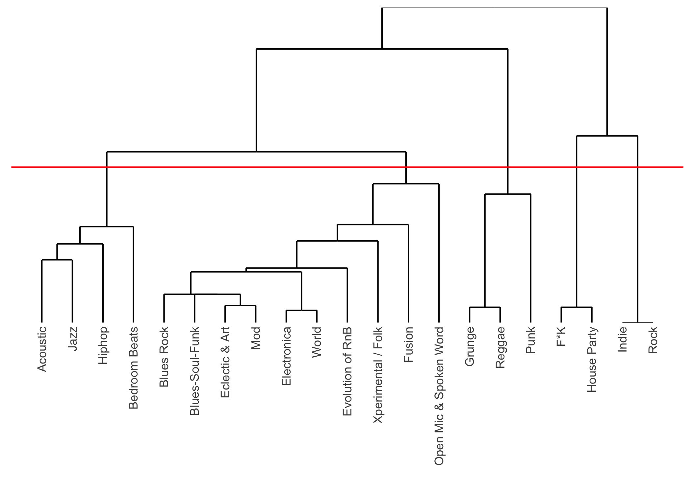

~~Looking at the map of where each stage in each zone is is, the results are quite obvious from simply looking at the first map. So why bother with all the cluster analysis non-sense? You could have easily done the same thing by printing the map and encircling the points close together and taking a picture of that and uploading it. Well, if Fête decided to have 99 pocket stages, would you still be willing?~~

Kidding aside, we use a complicated method because: \* we want the procedure to be scaleable so that when Fête does decide to have 99 stages we can repeat the procedure, \* we try to keep personal opinions out of the picture, and \* because we can.

In any case, the zones have been identified based on the area where they are (or where most of the member stages are at least.)

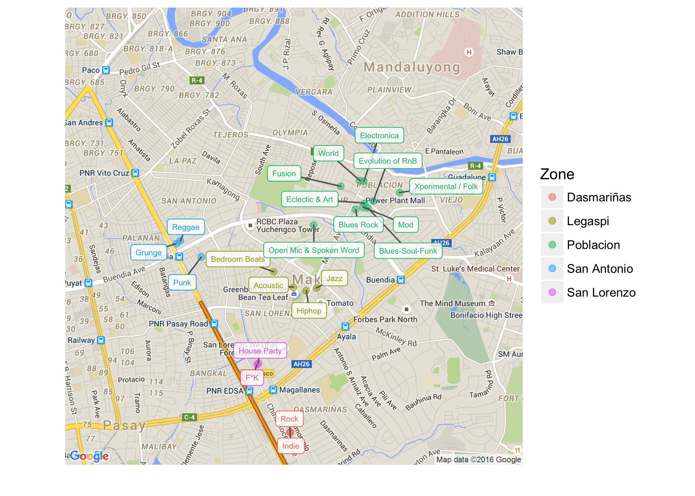

## Schedule

Unfortunately, the pocket stages do not last all night. Each stage has their own schedule, so we do not have as much freedom to visit the pocket stages any time of the night.

Those who know OR among you may know that this becomes not just a TSP, but a travelling salesman problem with time window (TSPTW). It's a more complex and less famous problem to solve. But again, we're not treating it as an OR problem.

Making things worse is that the start times of the gigs is not available for all pocket stages, let alone the end times. Some stages' published both the start and end times of their gigs; some just the start time; and some did not publish any schedule at all.

### Impute duration of stages

> Warning: Heavy statistics ahead. TL;DR If a stage published a start time but not the end time, we guessed what the end time will be.

To help us schedule our route, we need to have a complete set of information as much as possible. So for stages that did not publish an end time but did a start time, we try to approximate how long their gig is going to be.

For this kind of event, the most obvious determinant of the duration of a gig is how long its line-up is. Hence, we explore the relationship of the duration with the lineup length for the stages for which we can compute the ~~official~~ duration. We'll try to keep things as simple as we can because this doesn't affect our analysis much; although it is pertinent to determining schedules and routes.

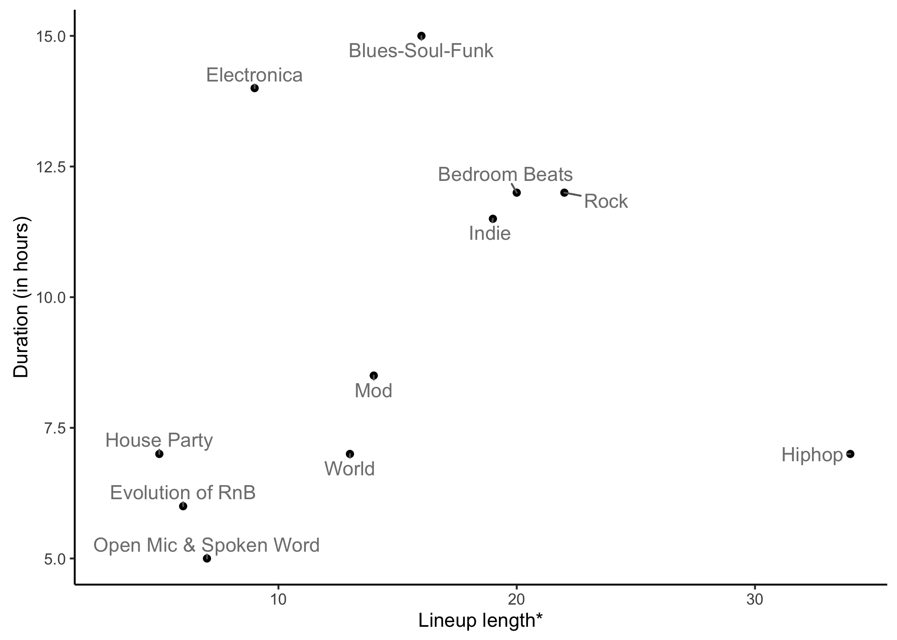

We define the length of the lineup loosely. It can be the number of performers, or concurrent performers if there are multiple sub-stages, or sections the host has scheduled for the night. Basically the most convenient unit of performance lineup to divvy the pocket gig length into equal time units.

We can observe in the plot above that the Electronica, Blues-Soul-Funk, and Hiphop stages seem to be outliers to the linear trend followed by the stages in the center of the chart.

The outliers mess up the otherwise positive linear trend of lineup lengths and durations. In order to limit the effect of these outliers, we use a robust regression technique to extract how much additional time would an additional performer or section in the lineup would increase the duration and the baseline duration of a gig.

The results of the regression are overlaid on the plot as shown below.

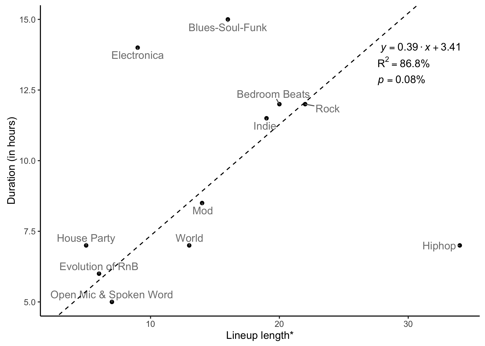

The regression model suggests that each pocket stage has a baseline duration 3.41 hours plus 0.39 hours more for each additional performer or section in their lineup length.

We won't read too much into this model. The only important thing is we have a model to help us impute or estimate how long the gig duration of the pocket stages that only published their start times based on the length of their lineup.

### Schedules and approximated schedules

Using the model in the previous section, the timeline below shows the schedules of all pocket stages for which we have information we can work on. Pocket stages that do not have a timeline are left blank in the plot.

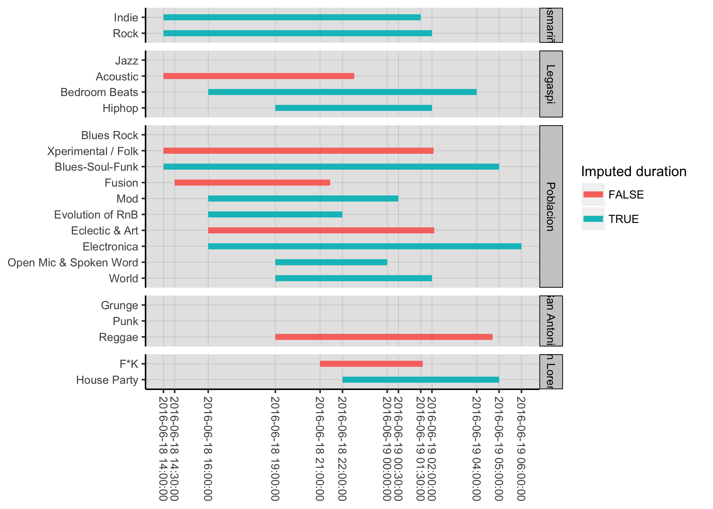

The plot above shows that the stages in Dasmariñas and Poblacion seem like ideal zones to start our adventure. These zones have stages that start quite early at 2:00 pm. If we look at the maps again, we can see that the other zones are not as accessible from these zones.

Looking at the timelines further, Poblacion seems to be the better zone to leave in the latter part of our adventure because there are more pocket stages there that last later than the other stages. Consequently, Dasmariñas could then be the where we start our quest.

Legaspi could then be visited around 7:00 pm to 10:00 pm since during that period most of its stages are still running; San Lorenzo around 10:00 pm to 1:30 am; and San Antonio around 7:00 pm to 4:00 am. Do keep in mind that time alone is not enough to determine how we're going to visit the stages. Unless you don't mind spending your night trudging around Makati CBD.

## Connecting pocket stages

Remember that we're assuming the order you visit pocket stages within zones don't matter. However, when you're about to switch zones, which pocket stage you will come from and which pocket stage in the destination zone you will arrive at do matter.

For each pair of zones, we note the two pairs of distinct pocket stages (one from each of the zones being paired up) that are closest to each other in terms of walking distance. The following table summarises what pairs of pocket stages in each pair of zones are ideal to be used as staging areas when switching from one zone to another.

<table class="gmisc_table" style="border-collapse: collapse; margin-top: 1em; margin-bottom: 1em;">
<thead>
<tr>
<th style="border-bottom: 1px solid grey; border-top: 2px solid grey;">
</th>
<th style="border-bottom: 1px solid grey; border-top: 2px solid grey; text-align: center;">
Dasmariñas
</th>
<th style="border-bottom: 1px solid grey; border-top: 2px solid grey; text-align: center;">
Legaspi
</th>
<th style="border-bottom: 1px solid grey; border-top: 2px solid grey; text-align: center;">
Poblacion
</th>
<th style="border-bottom: 1px solid grey; border-top: 2px solid grey; text-align: center;">
San Antonio
</th>
<th style="border-bottom: 1px solid grey; border-top: 2px solid grey; text-align: center;">
San Lorenzo
</th>
</tr>
</thead>
<tbody>
<tr>
<td style="border-right: 1px solid black; text-align: left;">
Dasmariñas
</td>
<td style="text-align: right;">
</td>
<td style="text-align: center;">
Jazz - Rock Acoustic - Indie
</td>
<td style="text-align: center;">
Blues Rock - Indie Rock - Open Mic & Spoken Word
</td>
<td style="text-align: center;">
Rock - Punk Indie - Grunge
</td>
<td style="text-align: center;">
Rock - F\*K House Party - Indie
</td>
</tr>
<tr>
<td style="border-right: 1px solid black; text-align: left;">
Legaspi
</td>
<td style="text-align: right;">
</td>
<td style="text-align: center;">
</td>
<td style="text-align: center;">
Jazz - Open Mic & Spoken Word Blues Rock - Acoustic
</td>
<td style="text-align: center;">
Bedroom Beats - Grunge Reggae - Acoustic
</td>
<td style="text-align: center;">
Bedroom Beats - F\*K Acoustic - House Party
</td>
</tr>
<tr>
<td style="border-right: 1px solid black; text-align: left;">
Poblacion
</td>
<td style="text-align: right;">
</td>
<td style="text-align: center;">
</td>
<td style="text-align: center;">
</td>
<td style="text-align: center;">
Open Mic & Spoken Word - Grunge Reggae - Blues Rock
</td>
<td style="text-align: center;">
F\*K - Open Mic & Spoken Word Blues Rock - House Party
</td>
</tr>
<tr>
<td style="border-right: 1px solid black; text-align: left;">
San Antonio
</td>
<td style="text-align: right;">
</td>
<td style="text-align: center;">
</td>
<td style="text-align: center;">
</td>
<td style="text-align: center;">
</td>
<td style="text-align: center;">
Punk - F\*K House Party - Grunge
</td>
</tr>
<tr>
<td style="border-bottom: 2px solid grey; border-right: 1px solid black; text-align: left;">
San Lorenzo
</td>
<td style="border-bottom: 2px solid grey; text-align: right;">
</td>
<td style="border-bottom: 2px solid grey; text-align: center;">
</td>
<td style="border-bottom: 2px solid grey; text-align: center;">
</td>
<td style="border-bottom: 2px solid grey; text-align: center;">
</td>
<td style="border-bottom: 2px solid grey; text-align: center;">
</td>
</tr>
</tbody>
</table>
The pair of stages on top of the other in each cell is the pair that has the least walking distance between each zone. The pair below each cell is the distinct pair with the second shortest walking distance.

Below is a map showing the same information.

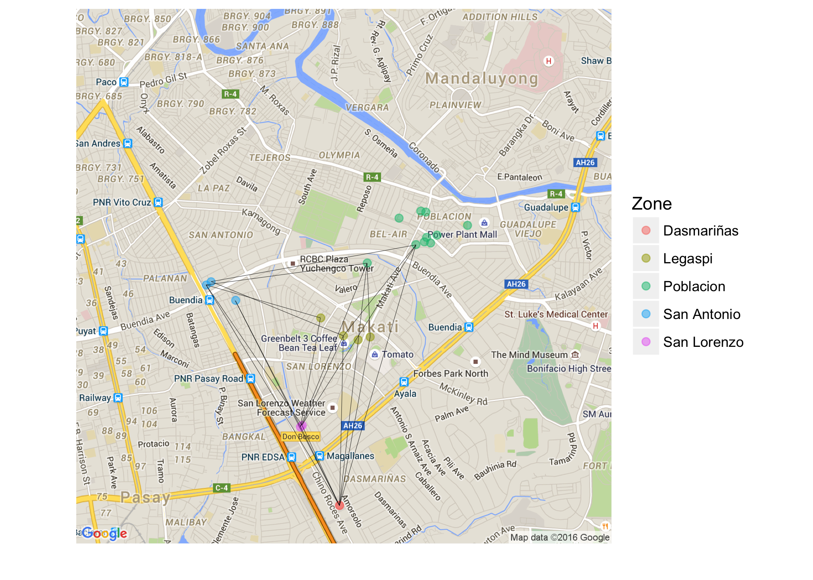

We take the two closest distinct pairs of pocket stages from each comparison of zones because we would want to visit each stage only once. So the first pocket stage that we visit in a zone will not be the same pocket stage we will leave from when we move to another zone.

So upon arriving in a zone in one of the designated connecting pocket stages given the zone where you come from, you are free to visit the other pocket stages in any order as long as the last you stage you visit in that zone is its other connecting pocket stage.

## Ideal path

For the other geeks out there, the problem posed by Fête is not just represented by the TSP. It can also be viewed from the perspective of graph theory; where each zone is a node, each pocket stage is an attribute of the node, each path between zones is an edge, and the pocket stages of arrivals as well as departures are edge attributes.

Since there are multiple paths possible between two zones because of us considering two connecting pocket stages, the representative graph would have multiple edges between nodes. The chart below shows a visual representation of how we're going to view the graph. The zones are nodes and each pair of connecting pocket stages is an edge.

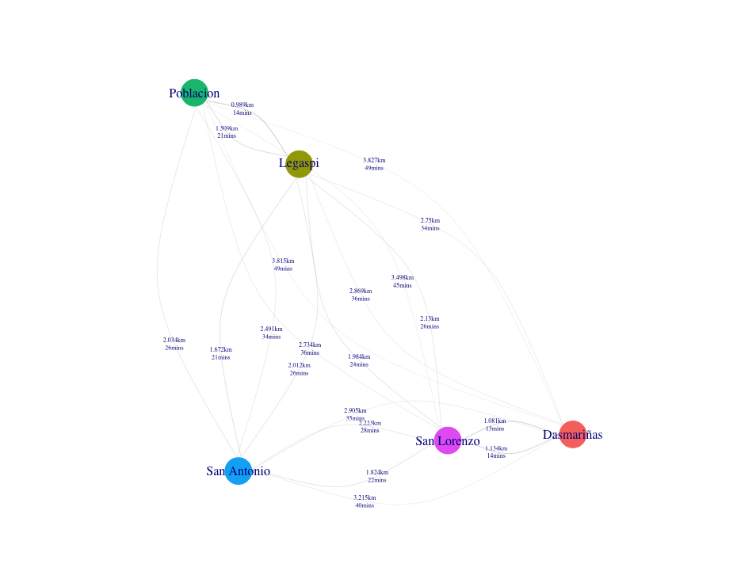

So here's the problem that we're going to solve: how do we visit each zone once and only once, while making sure we visit each pocket stage once and only once, in the shortest amount of walking time or distance?

Our problem has a few quirks that prevents it from being solved by the usual tools used in TSPs.

If we decide to visit the zone with the nearest connecting pocket stage, then the problem simply becomes what zone should we start in so that we waste the least effort walking between zones?

We've crunched the numbers for you, and the answer is highlighted right below:

<table class="gmisc_table" style="border-collapse: collapse; margin-top: 1em; margin-bottom: 1em;">
<thead>
<tr>
<th style="border-bottom: 1px solid grey; border-top: 2px solid grey; text-align: center;">
Starting zone
</th>
<th style="border-bottom: 1px solid grey; border-top: 2px solid grey; text-align: center;">
Total travel distance (in km)
</th>
<th style="border-bottom: 1px solid grey; border-top: 2px solid grey; text-align: center;">
Total travel time (in mins)
</th>
<th style="border-bottom: 1px solid grey; border-top: 2px solid grey; text-align: center;">
Step 1
</th>
<th style="border-bottom: 1px solid grey; border-top: 2px solid grey; text-align: center;">
Step 2
</th>
<th style="border-bottom: 1px solid grey; border-top: 2px solid grey; text-align: center;">
Step 3
</th>
<th style="border-bottom: 1px solid grey; border-top: 2px solid grey; text-align: center;">
Step 4
</th>
</tr>
</thead>
<tbody>
<tr>
<td style="text-align: center;">
Dasmariñas
</td>
<td style="text-align: center;">
6.691
</td>
<td style="text-align: center;">
86.90
</td>
<td style="text-align: center;">
Rock - F\*K
</td>
<td style="text-align: center;">
Acoustic - House Party
</td>
<td style="text-align: center;">
Jazz - Open Mic & Spoken Word
</td>
<td style="text-align: center;">
Reggae - Blues Rock
</td>
</tr>
<tr>
<td style="text-align: center;">
Legaspi
</td>
<td style="text-align: center;">
6.438
</td>
<td style="text-align: center;">
84.38
</td>
<td style="text-align: center;">
Jazz - Open Mic & Spoken Word
</td>
<td style="text-align: center;">
Reggae - Blues Rock
</td>
<td style="text-align: center;">
Punk - F\*K
</td>
<td style="text-align: center;">
House Party - Indie
</td>
</tr>
<tr style="background-color: #ffbbff;">
<td style="background-color: #ffbbff; text-align: center;">
Poblacion
</td>
<td style="background-color: #ffbbff; text-align: center;">
5.619
</td>
<td style="background-color: #ffbbff; text-align: center;">
71.53
</td>
<td style="background-color: #ffbbff; text-align: center;">
Jazz - Open Mic & Spoken Word
</td>
<td style="background-color: #ffbbff; text-align: center;">
Bedroom Beats - Grunge
</td>
<td style="background-color: #ffbbff; text-align: center;">
Punk - F\*K
</td>
<td style="background-color: #ffbbff; text-align: center;">
House Party - Indie
</td>
</tr>
<tr>
<td style="text-align: center;">
San Antonio
</td>
<td style="text-align: center;">
7.240
</td>
<td style="text-align: center;">
93.05
</td>
<td style="text-align: center;">
Bedroom Beats - Grunge
</td>
<td style="text-align: center;">
Jazz - Open Mic & Spoken Word
</td>
<td style="text-align: center;">
Blues Rock - House Party
</td>
<td style="text-align: center;">
Rock - F\*K
</td>
</tr>
<tr>
<td style="border-bottom: 2px solid grey; text-align: center;">
San Lorenzo
</td>
<td style="border-bottom: 2px solid grey; text-align: center;">
7.311
</td>
<td style="border-bottom: 2px solid grey; text-align: center;">
95.47
</td>
<td style="border-bottom: 2px solid grey; text-align: center;">
Rock - F\*K
</td>
<td style="border-bottom: 2px solid grey; text-align: center;">
Jazz - Rock
</td>
<td style="border-bottom: 2px solid grey; text-align: center;">
Jazz - Open Mic & Spoken Word
</td>
<td style="border-bottom: 2px solid grey; text-align: center;">
Reggae - Blues Rock
</td>
</tr>
</tbody>
</table>
Do note that the stages in each of the steps are in no particular order.

The chart below more clearly shows how much efficient starting in Poblacion is compared to the alternatives.

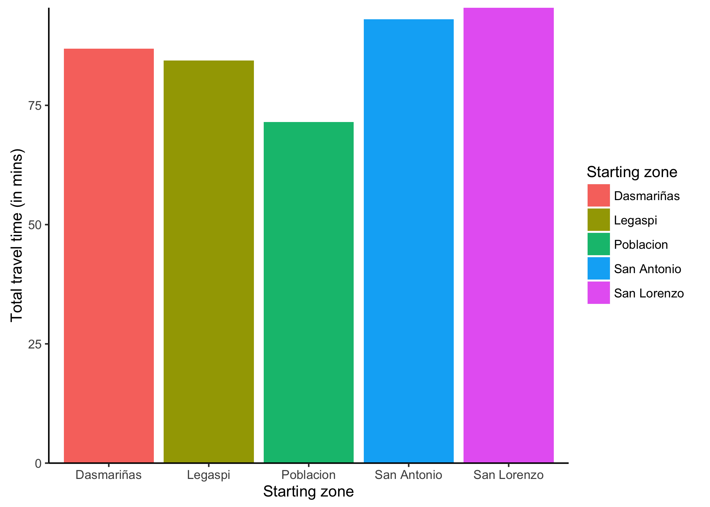

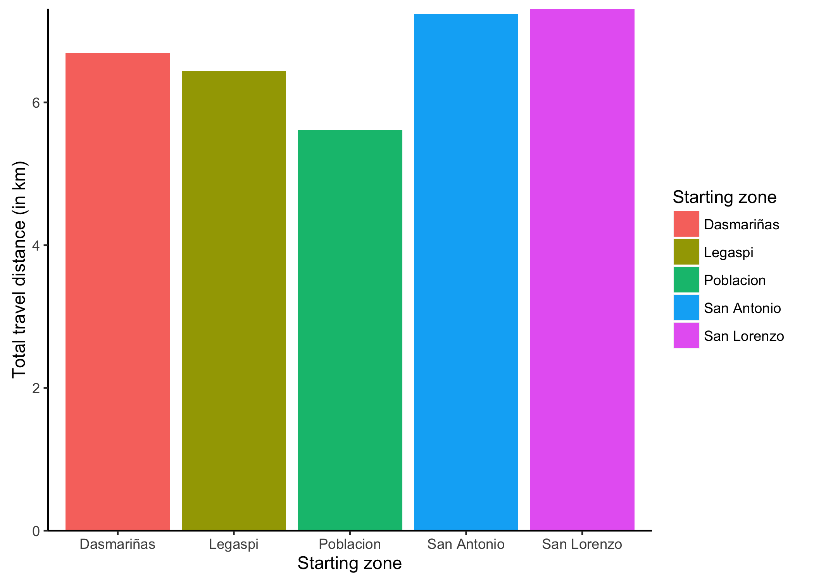

As much as 24 minutes of walking time and 1.69 km of walking distance can be saved compared to picking the wrong zone to start in.

That said, the map below shows where these connecting pocket stages are.

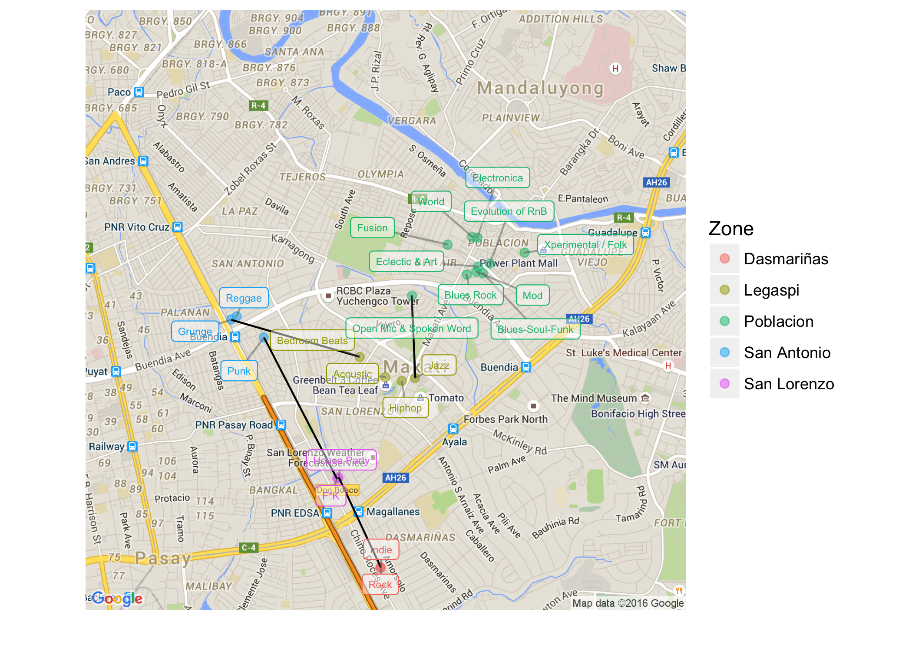

And the table below shows some details on the connecting walks between the zones.

<table class="gmisc_table" style="border-collapse: collapse; margin-top: 1em; margin-bottom: 1em;">
<thead>
<tr>
<th style="border-bottom: 1px solid grey; border-top: 2px solid grey; text-align: center;">
Beginning zone
</th>
<th style="border-bottom: 1px solid grey; border-top: 2px solid grey; text-align: center;">
Step
</th>
<th style="border-bottom: 1px solid grey; border-top: 2px solid grey; text-align: center;">
Source
</th>
<th style="border-bottom: 1px solid grey; border-top: 2px solid grey; text-align: center;">
Destination
</th>
<th style="border-bottom: 1px solid grey; border-top: 2px solid grey; text-align: center;">
Distance (in km)
</th>
<th style="border-bottom: 1px solid grey; border-top: 2px solid grey; text-align: center;">
Walk Duration (in mins)
</th>
<th style="border-bottom: 1px solid grey; border-top: 2px solid grey; text-align: center;">
Connecting stages
</th>
</tr>
</thead>
<tbody>
<tr>
<td style="text-align: center;">
Poblacion
</td>
<td style="text-align: center;">
1
</td>
<td style="text-align: center;">
Poblacion
</td>
<td style="text-align: center;">
Legaspi
</td>
<td style="text-align: center;">
0.989
</td>
<td style="text-align: center;">
14.33
</td>
<td style="text-align: center;">
Jazz - Open Mic & Spoken Word
</td>
</tr>
<tr>
<td style="text-align: center;">
Poblacion
</td>
<td style="text-align: center;">
2
</td>
<td style="text-align: center;">
Legaspi
</td>
<td style="text-align: center;">
San Antonio
</td>
<td style="text-align: center;">
1.672
</td>
<td style="text-align: center;">
20.75
</td>
<td style="text-align: center;">
Bedroom Beats - Grunge
</td>
</tr>
<tr>
<td style="text-align: center;">
Poblacion
</td>
<td style="text-align: center;">
3
</td>
<td style="text-align: center;">
San Antonio
</td>
<td style="text-align: center;">
San Lorenzo
</td>
<td style="text-align: center;">
1.824
</td>
<td style="text-align: center;">
22.5
</td>
<td style="text-align: center;">
Punk - F\*K
</td>
</tr>
<tr>
<td style="border-bottom: 2px solid grey; text-align: center;">
Poblacion
</td>
<td style="border-bottom: 2px solid grey; text-align: center;">
4
</td>
<td style="border-bottom: 2px solid grey; text-align: center;">
San Lorenzo
</td>
<td style="border-bottom: 2px solid grey; text-align: center;">
Dasmariñas
</td>
<td style="border-bottom: 2px solid grey; text-align: center;">
1.134
</td>
<td style="border-bottom: 2px solid grey; text-align: center;">
13.95
</td>
<td style="border-bottom: 2px solid grey; text-align: center;">
House Party - Indie
</td>
</tr>
</tbody>
</table>

## Recommended path

Without getting too complicated, let's take into account the schedule of the pocket stages to try to draft the itinerary:

We should start going around the Poblacion pocket stages starting 2:00 pm until around 7:30 pm when we leave from the **Open Mic & Spoken Word** stage. From the Poblacion stages, we move to the **Jazz** stage in Legaspi, arriving there perhaps at around 7:45 pm. The tour in Legaspi would then continue to the **Hiphop** and **Acoustic** stages; and must end in the **Bedroom Beats** stage where we must leave for San Antonio around 9:30 pm. From Legaspi, we must then proceed to the **Grunge** stage in San Antonio arriving at approximately 9:55 pm. The San Antonio leg then continues on to the **Reggae** stage, and then the **Punk** stage before moving on to San Lorenzo by 11:30 pm. Arrival in either the **F\*K** or **House Party** stages would be close to 12:00 am. Departure from the second San Lorenzo stage to Dasmariñas must be made around 12:40 am where we can enjoy the last stages starting around 1:00am until it ends at around 1:30 am. After that time, a few stages in all the other stages would still be playing to your heart's content or until around 5:00 am.

This itinerary has been determined heuristically rather than properly optimised. We simply extracted an ideal route based on which one would lead to the least walking. How much time to spend in each stage has been determined thru proper vizualization-assisted trial-and-error magic. A proper optimization of both the route and the time schedule of the itinerary may be a problem for another day.

But I wouldn't recommend optimising the route and time schedule of the itinerary down to the second. Doing so can make you more likely forget what's truly important --- to enjoy. Entering and leaving bars on a precise schedule is what alcoholics might do. I'm sure there are other things you can occupy yourself with than the schedule. Especially during the one day of the year when everybody's music surrounds you.
