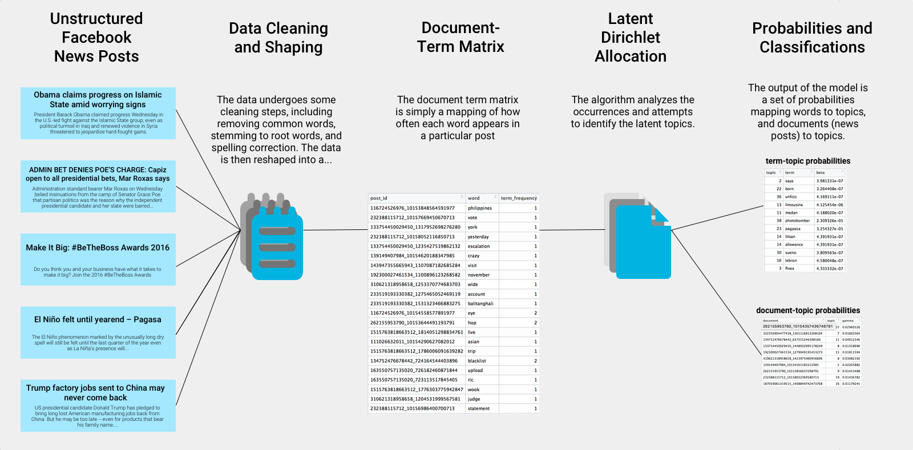
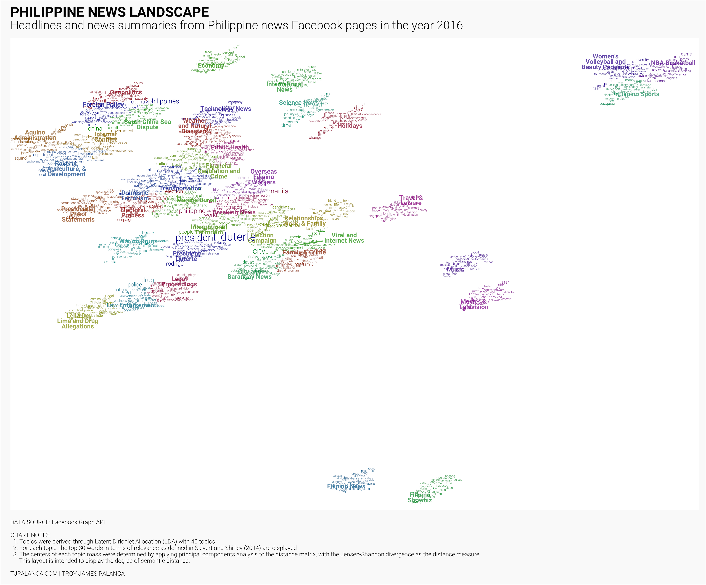
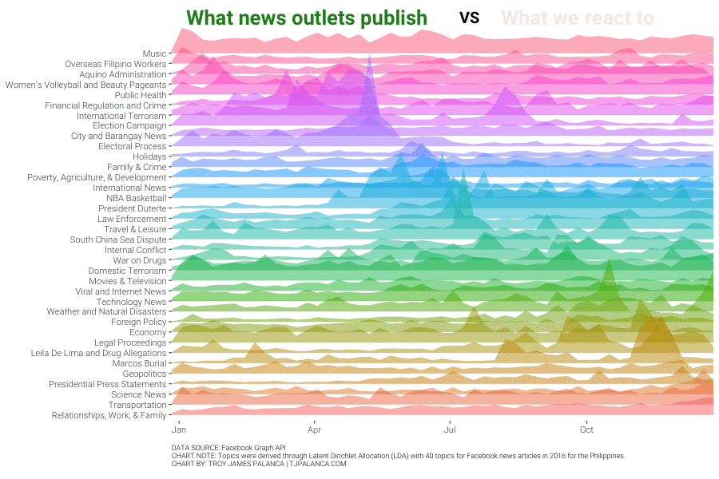

```{r layout="l-screen", out.extra="style='object-fit: cover; max-height: 30vh;'"}

```

## Motivation: Social Media in the Philippines

### "I read it on Facebook"

The Philippines is the social media capital of the world. According to [this Huffington Post article](http://www.huffingtonpost.com/jonha-revesencio/philippines-a-digital-lif_1_b_7199924.html)[@Revesencio_2017], "from a global average of 4.4 hours/day, the Filipino spends an average of 6.3 hours/day online via laptop and 3.3 hours/day via mobile." It's then no surprise that social media has become one of the main news sources for many Filipinos, and with a tumultuous 2016 Presidential Election, many issues have cropped up, from [the newly elected President hitting media for "biased" news](http://newsinfo.inquirer.net/784772/duterte-hits-media-for-sensationalism-bias), [introducing legislation around the spread of "fake news" on social media](http://www.philstar.com/headlines/2017/01/19/1664130/pangilinan-wants-facebook-penalized-over-fake-news), to [a campaign engineering a social media machine designed to weaponize hatred](http://www.bbc.com/news/blogs-trending-38173842).

<aside style="min-width: 250px;">
<a id='5yqgfHHHTRVW2yXw3-vs8Q' class='gie-single' href='http://www.gettyimages.com/detail/630076470' target='_blank' style='color:#a7a7a7;text-decoration:none;font-weight:normal !important;border:none;display:inline-block;'>Embed from Getty Images</a><script>window.gie=window.gie||function(c){(gie.q=gie.q||[]).push(c)};gie(function(){gie.widgets.load({id:'5yqgfHHHTRVW2yXw3-vs8Q',sig:'VT7JWktBvUTYCPEO8ZcUjUZg8-GPpMaDe686coLXR5k=',w:'594px',h:'396px',items:'630076470',caption: true ,tld:'com',is360: false })});</script><script src='//embed-cdn.gettyimages.com/widgets.js' charset='utf-8' async></script>
<figcaption>Philippines President Rodrigo Duterte (R) poses for a selfie during a meeting with the Filipino community in Singapore on December 16, 2016. </figcaption>
</aside>

Since social media and the internet is such a vast place, how much do we really know about the Philippine news landscape online? This series is intended to explore the phenomenon by analyzing the unstructured text information in news posts for the entire 2016.

### "Biased media"

Mainstream news outlets, many of which have a significant online presence, have come under fire for apparently over or under-reporting certain events, usually against the newly-elected President and other government officials. By de-emphasizing positive news and constantly posting negative news about the administration, critics of mainstream media claim that there is an attempt to discredit the administration and turn the public opinion against them.
This seems like a problem we can address and answer with data, and that's exactly what we'll try to do in the first part of this series.

## Process: Topic modeling

To answer the question, we need data, and the most complete source of data is on Facebook, by far the most commonly used social media platform on the Islands, particularly the [Facebook Graph API](https://developers.facebook.com/docs/graph-api)[^1]. We extract data from this API for the top news pages in the country, then apply topic modeling to the content of the headlines, captions, and posts.

[^1]: If you are looking for the source of this data, unfortunately Facebook has altered their APIs and it is no longer straightforward to extract this information, and the Terms of Service inhibit me from sharing the raw data. 

```{r layout="l-page", fig.cap="TOPIC MODELING - A brief overview of how topic modeling is performed. (click to zoom)"}

```

Topic modeling, in natural language processing and machine learning, is a way for us to take unstructured text such as headlines, captions, and posts, and discover latent "topics" or themes that are underlying the corpus. For this specific article, we use Latent Dirichlet Allocation (LDA)[@lda_blei_ng_jordan] In other words, by taking into consideration the words used, we are able to define certain topics then classify each post in the topic to which the article belongs. For more information, please read the [technical documentation](#technical-documentation).

## News landscape of the Philippines

### News 'atlas' of the Philippines

Once we perform the topic modeling, we can generate some pretty interesting visualizations. See here for an overview of the news landscape of the Philippines, each group is composed of the most relevant words for that topic, and a manually-determined label. The distances that the topics have from each other reflect their semantic distance, or basically how different the words are for that topic.

```{r layout="l-page", fig.cap="News Landscape of the Philippines (click to zoom)"}

```

As you can see there is a central mass of mainly English news on both local and international topics. In the periphery are mostly lifestyle and entertainment topics, on the far top right there are sports news, and then Filipino language news settles at the bottom.

In the center of the mass you can see what (or who) is clearly the center of most news in 2016 - newly elected President Duterte. Spanning out from that topic are those of his policies and programs, the War on Drugs, his campaign, law enforcement, the Marcos Burial, and the drug-related charges filed against his critic Senator Leila de Lima. 

To the northwest of President Duterte, you'll see more general nationwide news - electoral process, transportation, finance and economy, and the weather.

You'll see further northwest a slightly separated island that covers international news, foreign policy, and the exiting Aquino Administration, whose main focus in the final years of his term was to secure an arbitral judgement against China for its claims in the South China Sea.

One thing to note is that Women's Volleyball and Beauty Pageants seems to have lumped together. Why? I have no clue.

### Sample articles

But wait, how can we determine that these topic classifications actually make sense? Let's try to pull out sample articles classified by the model and see if they can be understood.

```{r layout="l-screen", fig.cap="Sample articles from the LDA classification (click to zoom)"}
knitr::include_graphics("figures/topic-classification-sample.png")
```

Inspecting the headlines seems to show that the topics are well classified. For more details about how the model was trained, you are welcome to view the [technical documentation](#technical-documentation).

## Topic trends in 2016

Now that we are confident that topic classification is attained reasonably well, let's take a look at the trends over time.

```{r layout="l-body-outset", fig.cap = "TOPIC TRENDS - Hover over each square to view sample articles. Red dots indicates 'peaks' for each topic ([full screen](figures/topic-trends.html))"}
knitr::include_url("figures/topic-trends.html", height = "800") 
```

We can see here how 2016 progressed in terms of "hot topics" in each week:

<small>

* Jan - We started the year with **Filipino Showbiz** leading off from MMFF 2015
* Feb to Mar - a lull in the news save for a bout of local election related violence showing up in **City and Barangay News**.
* Apr - the RCBC Money Laundering Scandal topped the charts in **Financial Regulation and Crime**,
* May - entirely dedicated to the **Election Campaign** and the final election week contained many articles about the **Electoral Process**
* Jun - after the election of **President Duterte**, the news was filled with details of his stunning rise to power and what the new administration will do, **NBA Basketball** also dominated in June as the finals were taking place,
* Jul to Aug - a mixed bag, covering negotiations taking place with groups causing **Internal Conflict**, drug lists being released in **Law Enforcement**, and a fresh new bout of **Domestic Terrorism** from the Abu Sayyaf Group,
* Sep - **Technology News** peaked with the release of the new iPhone 7 and Apple Watch, the **War on Drugs** started to come under fire from critics, with staunch critic **Leila De Lima and Drug Allegations** surfacing during the last week,
* Oct - **Foreign Policy** was a hot topic, with President Duterte pivoting to align more closely with China, and raising concerns about the viability of the claim in the South China Sea,
* Nov - the **Marcos Burial** was top news for 4 straight weeks
* Dec - we round out the rather tumultuous year with many articles about **Relationships, Work and Family**, **Science News**; also, the annual Christmas rush has brought articles related to **Transportation**.

</small>

If you're interested in viewing the trend for a particular topic, you can use this chart to view it. Simply hover over the line to highlight it and display the topic name.

```{r layout="l-body-outset", fig.cap = "TOPIC TRENDS - Hover over each line to view the line in relation to others and to display the topic name as a tooltip ([full screen](figures/topic-trends-line.html))"}
knitr::include_url("figures/topic-trends-line.html", height = "800") 
```

## News page topic distribution

### News page distribution

A common accusation leveled against traditional news media is the amount of bias in reporting various topics. We try to explore the topic distribution of news articles.

```{r layout="l-body-outset", fig.cap="BIAS AND BALANCE - Check the news distribution and hover over each bar for details ([full screen](figures/topic-distribution-pages.html))"}
knitr::include_url("figures/topic-distribution-pages.html", height = "600") 
```

A few observations from the chart:

* Most major news articles have an even balance of news
* GMA News focused a lot on Filipino Showbiz, ABS-CBN focused on Movies & Television
* INQUIRER.net focused Law Enforcement and the War on Drugs
* Oddly enough, ANC 24/7's articles were mostly about Women's Volleyball and Beauty Pageants

### News page topic concentration

We know how each of the topics are distributed, but how do we measure topics against each other in terms of topic concentration and potential "bias". One way to measure concentration across different topics is the Herfindahl-Hirschman Index (HHI). This index ranges from 0 to 100 with 100 meaning perfect concentration.

```{r layout="l-body-outset", fig.cap="TOPIC CONCENTRATION - Hover over each bar to see the top topics for that page ([full screen](figures/topic-concentration.html))"}
knitr::include_url("figures/topic-concentration.html", height = "800") 
```

The most concentrated were news pages that focused mainly on Filipino subjects (which got lumped together), but apart from that the interesting findings are:

* SunStar News, a Cebu based newspaper, focused mainly on local news, particularly in Visayas and Mindanao.
* Yahoo Philippines almost always just talked about entertainment topics, and MSN Philippines focused on lifestyle topics.
* Main news outlets, contrary to the comments posted on these pages, were the least concentrated and had the widest topic distribution.

## Reactions to topics

If topics are relatively well distributed in terms of topics, then how do we go about explaining the perception of biased media. Well, Facebook's timeline is heavily geared to provide information relating to topics that you have already interacted with. If we compare the amount of news articles published per topic over time, with the reactions we have to them over time:

```{r layout="l-body-outset", fig.cap="REACTIONS VS ARTICLES - What news publish vs what topics we interact with."}

```

We can clearly see that this might just be because of people overindexing on topics that are most popular or those that they are more interested in.

## Final remarks

Using natural language processing and topic modeling, we are able to turn unstructured text information and uncover latent topics in the corpus, so we can learn about the entire online news landscape in the country, not just what pops up in our newsfeeds. Some key takeaways from this exercise would be:

1. Despite being a politics-driven year, we are still obsessed with entertainment. Movies, Television, and Showbiz all have taken top spots in the news.
2. There are definite spikes in activity during certain weeks. Some of the most newsworthy events were the Elections in May, the South China Sea dispute in July, President Duterte in May and again in June, and the Marcos Burial in November.
3. Despite what Facebook commenters may say, news pages are well distributed in terms of topics, and do not solely focus on particular topics. What actually appears on people's newsfeeds, which is dependent on what users interact with, is another story.

## Technical documentation

In the interest of reproducible research, here are the notebooks containing the code, results, and commentary behind the post. You may download the resulting code and run it yourself, provided:

* You have the proper API keys to access the Facebook Graph API[^1], and 
* You agree that this is provided as-is and with no warranty.
  
You may also view the GitHub Repository [here](https://github.com/tjpalanca/facebook-news-analysis) for the complete code and analysis that went into this post. You may also choose to collaborate with me in producing more parts to this series!
 
* [Part 1 - Facebook Graph API Extraction](docs/fb-scraping.html)
* [Part 2 - Facebook Topic Modeling](docs/fb-topic-modeling.html)
