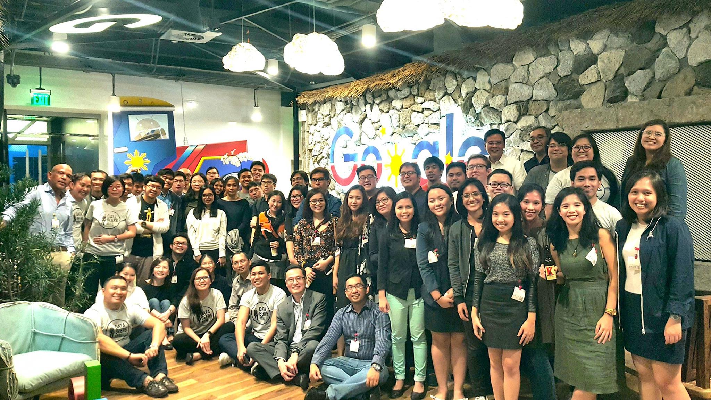

```{r layout="l-body-outset", fig.cap="The Databeers Manila crowd at the Google Philippines office. (Source: [Databeers Manila](https://www.facebook.com/databeersmnl))"}

```

<p class="uk-dropcap">
Last week, I had the chance to speak at [Databeers Manila](https://www.facebook.com/databeersmnl/), which is a data science event infused with the power of good ol' beer. The event was held in the Google Philippines office, and beer was care of [Katipunan Craft Ales](https://www.facebook.com/KatipunanCraftAles/). Most of the stuff I covered is already in my [previous post](/posts/2017-03-12-facebook-news-topic-modeling/), apart from the new word vectors stuff which I hopefully will be able to write something on soon. I did use the new `ggjoy` and `gganimate` packages to produce this cool new way of making my main point:
</p>

```{r layout="l-body-outset", fig.cap="REACTIONS VS ARTICLES - What news publish vs what topics we interact with"}
knitr::include_graphics("../2017-03-12-facebook-news-topic-modeling/figures/reactions-vs-articles.gif")
```

The point being that media isn't biased in that your timeline is. 

<script async class="speakerdeck-embed" data-id="877063d74a7242b78bc95af80078acca" data-ratio="1.33333333333333" src="//speakerdeck.com/assets/embed.js"></script>

Databeers is set to keep going, so if you're interested in sharing your data thoughts or are interested in attending, just get in contact or go through [Facebook](https://www.facebook.com/databeersmnl/), [Twitter](https://twitter.com/databeersmnl) or [Tumblr](https://databeersmnl.tumblr.com).
