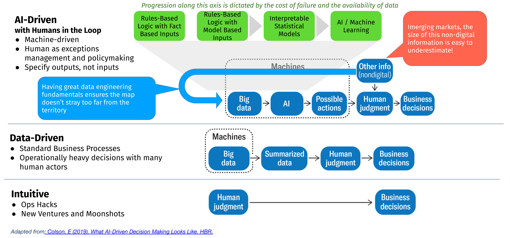

As software moves closer and closer to traditional industry (think ridesharing, fin-tech, agri-tech, etc.), more and more data products are being built to support or automate decisions that would normally be made by human experts. As this happens, there typically is a valid doubt as to whether a data product can automate a solution to a high enough standard that it becomes worth the investment.

When unmanaged, this uncertainty can stall the production of otherwise good data products. Either the data product will be developed in a way that materially harms the business because the data scientists overestimated the value of their models, or human experts will reject the product entirely and never realize any value from their data.

I'm trying to write down some tips in dealing with design uncertainty in data products: (a) build in parameterization or agility into your data products, and (b) evolve your data products in an agile way. These concepts are typically not new to product management, but as data scientists find themselves in situations where they have to be their own product manager, I think it is useful to phrase it through this lens.

## Building in parameterization where we don't have data

Should we cap credit limits at 10 million PHP or 15 million PHP? Sometimes, there is no data-driven way to answer this question because we don't have examples of how users would react to this policy. The domain expert may also be uncomfortable about making a strong decision on what that number should be, but in a typical software development context, there is a demand to spec that user story down to the exact parameter.

In these cases, the best course of action is to invest time in parameterizing these decisions. We can set them at the value that makes sense for now but builds into the product functionality to quickly switch this parameter once we have new information (and to replace this with some machine-learned decision once we have enough examples).

This way, product development can move forward without having to make potentially costly decisions that are hard to reverse down the line.

Put another way: you can either build perfect prediction such that you know exactly what will happen as you roll out your data product, or you can build in split-second reaction times such that you'll never really need the forecast.

## Evolving data products

Not everything has to be a neural network at the start; in fact, if you are starting a project with statistical modeling or machine learning top of mind, you'll probably face a lot of issues.

A way to deal with model performance uncertainty is to take smaller steps in your automation journey. You can see here three distinct levels where data is taking an increasingly important role in making that decision. While progression from "Intuitive" to "Data-Driven" to "AI-Driven" is clear and probably no one will find issues with trying to progress up that ladder, it's typically the green boxes (the level of AI involvement) where projects tend to trip up.

```{r layout='l-body-outset'}

```


What one can do here is progress up the green boxes by really just starting with typical software - rules-based logic with fact-based inputs. Once we get comfortable and continue to collect data/reduce uncertainty around how to make the right decisions, you can progress up the chain and add more modeling elements to it.

Two factors influence how fast you can progress across the green axis:

1. **Cost of failure** - this is inherent to the decision you are trying to automate. The cost of failure of a poorly underwritten loan is going to be much lower than serving up the wrong recommendation on an e-commerce site.
2. **Data completeness** - this is where data engineering fundamentals are absolutely critical. A problem like image processing is data complete; whatever info is needed to 100% say whether something is a dog or a cat is already in the image. Whereas, when you are trying to lend someone money, you can hardly observe every aspect of how that person manages his/her finances or runs his/her business. If you can automate data collection in a cheap and automated way, then you are much more likely to progress to more advanced forms of decision automation.
