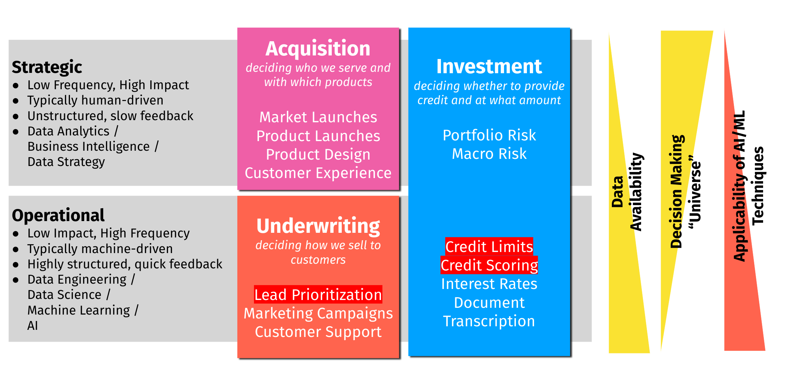

```{r layout="l-body-outset", fig.cap="Photo by Franki Chamaki on Unsplash"}

```

## Data teams don't come built-in

Most data teams don't come "built-in" to most companies that don't start with data as the primary product.

There will usually be a team in charge of sales and distribution (Sales, Marketing, Growth, Operations), a team in charge of product purchasing or development (Product, Engineering), and general administration (Finance, Leadership, HR).

By the time companies begin to even consider the concept of a data team is when they have achieved some non-trivial amount of scale (read: post Product Market Fit).

That doesn't mean that data teams are of no real use -- it just means that people who find themselves being data person \#1 in a startup or large company usually encounter the issue of either finding the areas for which they or their team can be responsible or for proving relevance or value add to the business.

One thing I have found very useful is centering your data team's product around **decisions**.

## A data team's product is decisions

Regardless of where the type of data work is on the spectrum between data engineering, analytics, business intelligence, or modelling, the product of a data team is not the above, but decisions.

At First Circle, our team's goal is to ensure that **all decisions, whether strategic or operational, augmented or automated with data.**

## Types of decisions

There are two types of decisions that are usually what a data team should target: (a) bespoke, luxury strategic decisions, and (b) mass-produced, repeatable, and fast operational decisions.

```{r layout="l-body-outset", fig.cap="Strategic vs Operational Decisions"}

```

### Strategic Decisions

Strategic decisions are luxury, bespoke, and artisanal decisions; decisions that are made infrequently but have a large impact. There is a large amount of uncertainty and it's unlikely there is going to be a frequent feedback loop. For augmenting these decisions one would benefit from a business mindset, communication skills, and an ability to extract information from limited data (heavily custom linear models, or Bayesian techniques).

Examples of strategic decisions are product/market expansions, budget and headcount planning, competitive analysis, mergers, and acquisitions.

### Operational Decisions

Operational decisions are mass-produced, repeatable decisions that are made hundreds or thousands of times a day. They may not be that impactful individually, but the sheer volume makes optimizing these kinds of decisions important as well. The decision systems behind operational decisions are usually algorithmic in order to be cost-beneficial and would need machine learning, data science, and strong data engineering to productionize a system.

Examples of operational decisions are any per-transaction decisions, such as a bank's personal loan grant algorithm, a ridesharing company's driver dispatch algorithm, or an e-commerce company's recommendation algorithm.

Individuals who come into data science usually only think of the second type of a decision, but it's critical that data teams address both if they are the only team dealing with data, as running a business successfully requires both types of decisions to be data-driven.

## Considering both types in a data team's roadmap

When designing a data team's roadmap, I've found that it's important to be conscious of the difference between the two types of "products", and to ensure that the mix is appropriate for the business.

Too much spent on operational decisions may mean a long, drawn-out slog to first value delivered, as a lot of data collection and experimentation has to take place.

Too much spent on strategic decisions may mean that your company doesn't actually realize true technology value from data, you will then operate much like a traditional company that is just a little smarter with their information.

Worse and more common is mixing up the two; treating strategic decisions as operational or vice versa. I've seen many situations where people are using random forest variable important for a one-time decision ("insighting"), or where a human's role in a process is only pushing buttons and not actually applying any judgment.

What I suggest is laying these out in a board and highlighting the high priority items in both buckets. This exercise should be done in conjunction with your team's planning cycle.

In a future newsletter post, I'll write about how to structure a team that addresses these issues in a holistic way, and avoids the common pitfalls associated with ["pin factory" model](https://multithreaded.stitchfix.com/blog/2019/03/11/FullStackDS-Generalists/) that many new data teams adopt.\
